# MallCloud 微商城

MallCloud 是面向 Spring Cloud Alibaba 微服务课程设计的本地可运行微商城项目。项目围绕“登录、商品浏览、购物车、下单、库存锁定、模拟支付、支付消息、订单查询、搜索、秒杀、后台看板”的主链路组织交付，重点展示微服务拆分、Gateway 鉴权、服务调用、分布式事务、消息队列、限流熔断和前端验收证据。

本项目是课程项目，不宣称生产级商业系统能力。所有报告结论以当前仓库内可复跑测试、截图、脚本和 `docs/FINAL_REPORT.md` 的真实证据为准。

## 1. 项目概述

核心链路：

```text
用户登录 → 商品搜索/详情 → 加入购物车 → 创建订单
→ mall-order 调商品与库存 → Seata 事务锁定库存
→ mall-pay 模拟支付 → RocketMQ 支付结果消息
→ 订单状态更新 → 库存确认扣减 → 用户查询订单
```

本地后端统一使用连续端口区间，Gateway 入口为 `http://localhost:9100`。前端通过 Gateway `/api/v1/**` 访问后端，不直接调用内部微服务端口。

## 2. 项目亮点

- 13 个微服务模块按认证、用户、商品、购物车、订单、库存、支付、消息、搜索、秒杀、任务、后台聚合和网关拆分，公共能力沉淀在 `mall-common`。
- Gateway 具备 JWT 鉴权、白名单、用户上下文透传、内部接口外部阻断和 `X-Internal-*` 请求头净化测试。
- 订单创建使用 OpenFeign 调用商品与库存服务，并通过 Seata 管理订单与库存锁定一致性。
- 支付结果通过 RocketMQ 异步分发，订单服务和库存服务分别消费并更新业务状态。
- 秒杀链路使用 Redis 承载活动库存与请求状态，结合 Sentinel/限流规则进行并发入口保护。
- 搜索链路使用 Elasticsearch 索引商品数据，并保留 Gateway 搜索回归证据。
- 启动脚本已增强逐服务 PID、命令摘要和 health=UP 日志，便于答辩现场定位服务状态。
- 页面截图、PIL 尺寸、MD5、运行时回归和构建测试证据均归档到 `docs/`。

## 3. 技术栈

| 层次 | 技术 |
| --- | --- |
| 后端 | Java 21、Spring Boot 3.2.4、Spring Cloud Alibaba 2023.0.1.0、Spring Cloud Gateway、OpenFeign、MyBatis-Plus |
| 微服务治理 | Nacos、Sentinel、Seata 2.0.0 |
| 消息与缓存 | RocketMQ、Redis |
| 搜索 | Elasticsearch |
| 数据库 | MySQL 8.x |
| 前端 | Vue 3、Vite、TypeScript、Element Plus、Pinia、Vue Router、Axios |
| 工程环境 | Windows 11、PowerShell 7+、UTF-8、Maven 3.9+、Node.js/npm |

## 4. 系统架构图



Mermaid 源文件和导出资产见 [docs/diagrams/README.md](docs/diagrams/README.md)。

## 5. 功能模块

| 模块 | 当前能力 |
| --- | --- |
| Gateway | 统一入口、路由、JWT 鉴权、内部路径防护、请求头净化 |
| Auth/User | 演示账号登录、用户上下文、地址簿读取 |
| Product/Search | 商品详情、SKU、分类、Elasticsearch 搜索 |
| Cart | 购物车查询、加购、勾选、数量调整、删除 |
| Order/Inventory | 创建普通订单、地址快照、库存锁定、订单查询、后台订单 |
| Pay/Message | 模拟支付、支付结果消息、订单与库存消费 |
| Seckill | 秒杀活动、请求受理、结果轮询、库存不足与已结束响应 |
| Admin Biz | `/admin` 同页 Dashboard、后台订单区块、后台商品区块 |
| Scripts | 一键启动/停止、逐服务状态日志、专项测试入口 |

## 6. 角色与权限

| 角色 | 演示入口 | 说明 |
| --- | --- | --- |
| 游客 | `/`、`/search`、`/products/:id`、`/login` | 可浏览公共商品与登录注册入口 |
| USER | `/cart`、`/checkout`、`/orders/:orderNo`、`/pay/:orderNo`、`/seckill` | 可演示购物、下单、支付、秒杀 |
| MERCHANT | `/admin` | 当前与 ADMIN 共用后台页面入口，受角色守卫限制 |
| ADMIN | `/admin` | 可查看 Dashboard、后台订单和后台商品区块 |

当前前端不存在独立 `/admin/users` 用户管理页面，也没有用户管理区块；最终报告和截图不伪造该能力。

## 7. 核心业务流程

| 流程 | 图表 | 说明 |
| --- | --- | --- |
| 普通交易链路 | [核心交易链路图](docs/diagrams/svg/02-trade-flow.svg) | 商品、购物车、订单、库存、支付、消息闭环 |
| Gateway 防护 | [鉴权与内部路径防护图](docs/diagrams/svg/03-gateway-security.svg) | JWT 与 internal 路径阻断在 Gateway 层验证 |
| 分布式一致性 | [Seata 一致性图](docs/diagrams/svg/04-seata-order-inventory.svg) | 创建订单时订单与库存锁定保持一致 |
| 支付消息 | [RocketMQ 支付处理图](docs/diagrams/svg/05-rocketmq-pay-result.svg) | 支付结果异步驱动订单与库存状态 |
| 秒杀 | [秒杀限流图](docs/diagrams/svg/06-seckill-rate-limit.svg) | Sentinel/Redis/异步处理配合演示高并发入口 |
| 本地部署 | [本地部署拓扑图](docs/diagrams/svg/07-local-deployment.svg) | Windows + PowerShell + Docker 中间件 + 本地 JAR |

## 8. 数据库与初始化

初始化脚本位于 `db/init/`，演示数据以 `db/init/seed.sql` 为准。数据库初始化会重建业务表并写入课程演示账号。

```powershell
pwsh .\scripts\init-db.ps1 -Force
```

演示账号统一密码为 `123456`。

## 9. 快速启动

默认环境：Windows 11、PowerShell 7+、UTF-8、JDK 21、Maven 3.9+。

```bat
start-all.bat
stop-all.bat
```

需要参数化启动或故障排查时使用：

```powershell
pwsh .\scripts\start-all.ps1 -Profile full -SkipInfrastructure -SkipFrontend -SkipBuild -CleanLogs
pwsh .\scripts\stop-all.ps1
```

前端开发模式：

```powershell
Set-Location .\mall-frontend
npm install
npm run dev
```

更多启动细节见 [docs/QUICK_START.md](docs/QUICK_START.md) 与 [docs/DEPLOY.md](docs/DEPLOY.md)。

## 10. 演示账号

| 用户名 | 密码 | 角色 |
| --- | --- | --- |
| `zhangsan` | `123456` | USER |
| `merchant01` | `123456` | MERCHANT |
| `admin` | `123456` | ADMIN |

## 11. 答辩演示路径

1. 打开首页，说明微商城定位、Gateway 统一入口和服务拆分。
2. 使用 `zhangsan / 123456` 登录，搜索 `iPhone`，进入商品详情。
3. 加入购物车，进入购物车与结算页，创建普通订单。
4. 打开订单详情并进入模拟支付页，触发支付结果，解释 RocketMQ 消费链路。
5. 访问秒杀页，演示活动已结束或库存不足的真实响应口径。
6. 使用 `admin / 123456` 登录 `/admin`，展示 Dashboard、后台订单和后台商品区块。
7. 打开 `docs/FINAL_REPORT.md`、图表和截图矩阵，说明测试结果与边界。

## 12. 项目文档与材料

| 材料 | 入口 | 内容 |
| --- | --- | --- |
| 文档总索引 | [docs/README.md](docs/README.md) | 交付文档、图表、截图、答辩材料、综合报告入口 |
| 最终报告 | [docs/FINAL_REPORT.md](docs/FINAL_REPORT.md) | 最终验收结论、测试证据、边界与后续计划 |
| 图表交付区 | [docs/diagrams/README.md](docs/diagrams/README.md) | Mermaid 源文件、SVG/PNG 导出图 |
| 页面截图交付区 | [docs/page-screenshots/README.md](docs/page-screenshots/README.md) | 最终页面截图矩阵、尺寸和 MD5 |
| 答辩材料 | [docs/presentation/README.md](docs/presentation/README.md) | 视频脚本、PPT 大纲、答辩稿、关键代码导读 |
| 综合报告材料 | [docs/documents/README.md](docs/documents/README.md) | Word/PPT 组装建议和事实来源 |
| 设计基线 | [DESIGN.md](DESIGN.md) | 页面、交互、视觉 token 和验收口径 |
| 测试方法 | [docs/test/README.md](docs/test/README.md) | Postman、JMeter、浏览器和专项测试入口 |

## 13. 验收与测试

当前最终交付保留以下可验证结论：

| 项目 | 结果 |
| --- | --- |
| Gateway 测试 | 42/42 PASS，其中 `RealGatewayRandomPortTest` 9/9 PASS |
| 运行时回归 | 14/14 PASS |
| 启动日志 | 13/13 后端服务记录 PID 与 health=UP |
| 全模块构建 | `mvn -DskipTests package` PASS |
| 前端构建 | `npm run build` PASS |
| 页面截图 | 最终图库按 desktop/mobile 维度归档并经 PIL/MD5 校验 |

详细证据见 [docs/FINAL_REPORT.md](docs/FINAL_REPORT.md)。

## 14. 安全与边界说明

- 当前安全验证覆盖课程项目范围内的 Gateway 鉴权、internal 路径阻断和请求头净化，不宣称生产安全闭环。
- 本地演示依赖 Docker 中间件与本地 JAR；full profile 的镜像、资源和外部基础设施能力按报告中的真实验证结果描述。
- Admin 当前只有 `/admin` 同页 Dashboard、后台订单和后台商品区块；没有用户管理页面。
- 支付为课程项目模拟支付，不接入真实第三方支付。
- 秒杀以课程演示数据和本地环境验证为准，不代表生产压测能力。
- 未执行或无法复跑的内容在报告中标为“未验证”或“受限”，不写成通过。
