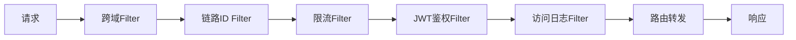
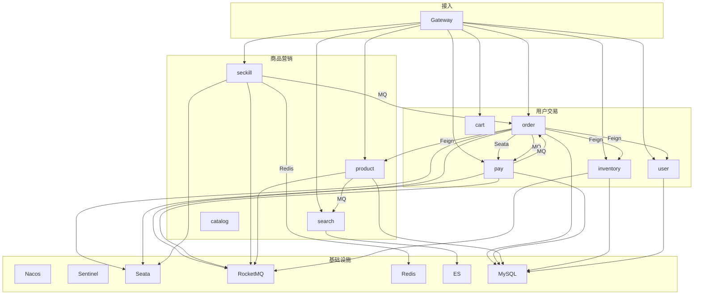

# MallCloud 架构详细设计文档

> 版本：v1.0.0
> 配套文档：`PRD.md`、`API.md`、`DEPLOY.md`、`DATABASE.md`

---

## 1. 架构总览

MallCloud 采用经典的"**前后端分离 + 微服务 + 容器化**"架构，整体分为四层：

```
┌──────────────────────────────────────────────────────────┐
│  表现层(Presentation)：Vue 3 用户前台 + Vue 3 商家后台      │
├──────────────────────────────────────────────────────────┤
│  接入层(Edge)：Spring Cloud Gateway + 全局 JWT 鉴权        │
├──────────────────────────────────────────────────────────┤
│  业务层(Business)：13 个 Spring Boot 微服务 + Feign 互通   │
├──────────────────────────────────────────────────────────┤
│  基础设施层(Infrastructure)：Nacos / Sentinel / Seata /   │
│  RocketMQ / Redis / MySQL / Elasticsearch / Zipkin         │
└──────────────────────────────────────────────────────────┘
```

设计原则：
- **AKF 扩展立方体**：X 轴（无状态服务复制）、Y 轴（业务域拆分）、Z 轴（数据分片）；
- **十二要素**：配置外置、依赖声明化、日志事件流、一次性构建制品；
- **CAP 折中**：核心交易链路保证 CP（Seata），非关键链路 AP（最终一致）。

---

## 2. 注册中心：Nacos

### 2.1 角色分工

| 组件     | 部署模式    | 端口  | 数据持久化               |
| -------- | ----------- | ----- | ------------------------ |
| Nacos    | 单机/集群    | 8848  | 本地 SQLite / MySQL      |

### 2.2 关键设计

- **心跳机制**：客户端 5s 发送心跳，15s 未收到判定下线；
- **服务发现**：消费者订阅 `mall-product` 服务列表，本地缓存 + 30s 刷新；
- **元数据**：通过 `spring.cloud.nacos.discovery.metadata` 传递 `version`、`region`、`zone`；
- **健康检查**：Nacos 端开启 `spring.cloud.nacos.discovery.watch.enabled=true`。

### 2.3 命名空间隔离

```
public      (默认, 共享配置)
dev         (开发环境服务 + 配置)
test        (联调环境)
prod        (演示/生产)
```

每个 Namespace 单独配置数据库：`<nacos.home>/data/<namespace>`。

### 2.4 客户端配置

```yaml
spring:
  application:
    name: mall-order
  cloud:
    nacos:
      discovery:
        server-addr: nacos:8848
        namespace: dev
        group: DEFAULT_GROUP
      config:
        server-addr: nacos:8848
        file-extension: yaml
        refresh-enabled: true
        shared-dataids: common-mysql.yaml,common-redis.yaml
```

---

## 3. 配置中心：Nacos Config

### 3.1 加载优先级

```
application.yaml (本地, 不可变)
  └─ extension-configs: common-*.yaml (公共配置)
       └─ shared-dataids: 业务级共享
            └─ ${spring.application.name}.yaml (服务私有)
                 └─ ${spring.profiles.active}.yaml (环境覆盖)
```

### 3.2 DataId 规范

```
mall-order.yaml                 # 公共配置
mall-order-dev.yaml             # dev 环境
mall-order-test.yaml            # test 环境
common-mysql.yaml               # 跨服务 MySQL
common-redis.yaml               # 跨服务 Redis
common-sentinel.yaml            # Sentinel 规则
```

### 3.3 热更新

```java
@RestController
@RefreshScope
public class PageConfigController {
    @Value("${mall.product.page-size:20}")
    private int pageSize;
}
```

监听变更：`ClientWorker` 轮询 `/configs/listener` 拉取 → `ContextRefresher.refresh()`。

### 3.4 配置加密

- 敏感字段（数据库密码、密钥）使用 `nacos-crypto` 插件 AES 加密；
- DataId 前缀 `ENC(...)` 标识。

---

## 4. 网关层：Spring Cloud Gateway

### 4.1 路由表

```yaml
spring:
  cloud:
    gateway:
      routes:
        - id: mall-auth
          uri: lb://mall-auth
          predicates:
            - Path=/api/v1/auth/**
        - id: mall-product
          uri: lb://mall-product
          predicates:
            - Path=/api/v1/products/**,/api/v1/categories/**
        - id: mall-order
          uri: lb://mall-order
          predicates:
            - Path=/api/v1/orders/**
        - id: mall-seckill
          uri: lb://mall-seckill
          predicates:
            - Path=/api/v1/seckill/**
        - id: mall-admin
          uri: lb://mall-admin-biz
          predicates:
            - Path=/api/v1/admin/**
```

### 4.2 全局 Filter 链



### 4.3 JWT 鉴权 Filter 设计

```java
public class JwtAuthFilter implements GlobalFilter, Ordered {
    public Mono<Void> filter(ServerWebExchange exchange, GatewayFilterChain chain) {
        String path = exchange.getRequest().getPath().value();
        if (isWhitelist(path)) return chain.filter(exchange);

        String token = exchange.getRequest().getHeaders().getFirst("Authorization");
        if (token == null || !token.startsWith("Bearer "))
            return unauthorized(exchange);

        Claims claims = parseToken(token.substring(7)); // HS512，与 mall-auth 共用 JWT_SECRET
        // 将 userId/roles 写入请求头
        ServerHttpRequest req = exchange.getRequest().mutate()
            .header("X-User-Id", claims.get("uid").toString())
            .header("X-User-Roles", String.join(",", claims.get("roles", List.class)))
            .build();
        return chain.filter(exchange.mutate().request(req).build());
    }
}
```

白名单由 Nacos `mallcloud.jwt.whitelist` 配置，支持精确路径和 `/**` 前缀匹配。默认不需要 Token：
- `POST /api/v1/auth/login`
- `POST /api/v1/users/register`
- `GET  /api/v1/search/**`
- `GET  /api/v1/products/**`
- `GET  /api/v1/categories/**`

### 4.4 CORS 配置

```yaml
spring:
  cloud:
    gateway:
      globalcors:
        cors-configurations:
          '[/**]':
            allowedOriginPatterns: "*"
            allowedMethods: "*"
            allowedHeaders: "*"
            allowCredentials: true
            maxAge: 3600
```

### 4.5 限流配置（网关级）

```yaml
spring:
  cloud:
    gateway:
      routes:
        - id: mall-seckill
          uri: lb://mall-seckill
          predicates:
            - Path=/api/v1/seckill/**
          filters:
            - name: RequestRateLimiter
              args:
                redis-rate-limiter.replenishRate: 500
                redis-rate-limiter.burstCapacity: 1000
                key-resolver: "#{@ipKeyResolver}"
```

---

## 5. 服务调用：OpenFeign

### 5.1 启用与降级

```java
@FeignClient(value = "mall-inventory", fallbackFactory = InventoryClientFallback.class)
public interface InventoryClient {
    @PostMapping("/api/v1/inventory/lock")
    Result<Boolean> lock(@RequestBody LockDTO dto);
}
```

```java
@Component
public class InventoryClientFallback implements FallbackFactory<InventoryClient> {
    public InventoryClient create(Throwable cause) {
        return dto -> {
            log.error("库存服务调用失败", cause);
            return Result.error("INVENTORY_DOWN", "库存服务暂不可用");
        };
    }
}
```

### 5.2 请求/响应拦截器

- **RequestInterceptor**：自动透传 `traceId`、`X-User-Id`、`X-User-Roles`；
- **Logger.Level**：FULL（开发）/ BASIC（生产）。

### 5.3 超时配置

```yaml
feign:
  client:
    config:
      default:
        connectTimeout: 3000
        readTimeout: 5000
  circuitbreaker:
    enabled: true
  retryer:
    maxAttempts: 2
    period: 100
    maxPeriod: 1000
```

---

## 6. 熔断限流：Sentinel

### 6.1 部署

- 客户端引入 `spring-cloud-starter-alibaba-sentinel`；
- Dashboard 部署 `bladex/sentinel-dashboard:1.8.6`，端口 8080 / 8719。

### 6.2 资源定义方式

```java
@SentinelResource(
    value = "createOrder",
    blockHandler = "blockHandler",
    fallback = "fallback"
)
public OrderVO createOrder(OrderDTO dto) { ... }
```

### 6.3 规则加载（三种方式）

1. **Dashboard 推送**：Dashboard 修改后通过 `SimpleHttpRuleManager` 推送到客户端；
2. **DataSource 拉取**：从 Nacos 拉取 JSON 规则，详见 `common-sentinel.yaml`；
3. **代码硬编码**：本地测试用 `@PostConstruct` 注入。

### 6.4 关键规则

```json
[
  {
    "resource": "createOrder",
    "grade": 1,
    "count": 200,
    "limitApp": "default",
    "strategy": 0,
    "controlBehavior": 0
  },
  {
    "resource": "seckill:execute",
    "grade": 1,
    "count": 500
  },
  {
    "resource": "inventory:lock",
    "grade": 2,
    "count": 20,
    "timeWindow": 5
  }
]
```

### 6.5 熔断降级

| 维度       | 阈值                          |
| ---------- | ----------------------------- |
| 慢调用比例  | RT > 1s 的调用占比 > 50%      |
| 异常比例    | 异常数 / 总数 > 50%           |
| 熔断时长    | 5s 半开探测                   |
| 最小请求数  | 10（避免冷启动误判）          |

### 6.6 限流算法

- **滑动窗口**：默认 QPS 统计；
- **漏桶**：用于秒杀平滑；
- **令牌桶**：用于一般业务。

---

## 7. 分布式事务：Seata

### 7.1 模式选型

使用 **AT 模式**（Automatic Transaction），特点：
- 自动生成反向 SQL（基于 undo_log）；
- 对业务侵入低（仅需 `@GlobalTransactional`）；
- 性能 OK（相对 XA 减少持锁时间）。

### 7.2 Server 端部署

- 单机模式：直接运行 `seata-server`；
- 注册中心：Nacos；
- 配置文件：`registry.conf` + `file.conf`；
- 存储模式：db（MySQL），三张表 `global_table` / `branch_table` / `lock_table`。

### 7.3 客户端集成

```xml
<dependency>
    <groupId>com.alibaba.cloud</groupId>
    <artifactId>spring-cloud-starter-alibaba-seata</artifactId>
</dependency>
```

```java
@GlobalTransactional(name = "create-order", rollbackFor = Exception.class)
public OrderVO createOrder(OrderDTO dto) {
    // 1. 创建订单 (本地事务)
    orderMapper.insert(order);
    // 2. 扣减库存 (远程 Seata 分支)
    inventoryClient.lock(dto);
    // 3. 创建支付单 (远程 Seata 分支)
    payClient.create(payDTO);
    return orderVO;
}
```

### 7.4 undo_log 表（每个业务库都要建）

```sql
CREATE TABLE `undo_log` (
  `id` BIGINT AUTO_INCREMENT PRIMARY KEY,
  `branch_id` BIGINT NOT NULL,
  `xid` VARCHAR(100) NOT NULL,
  `context` VARCHAR(128) NOT NULL,
  `rollback_info` LONGBLOB NOT NULL,
  `log_status` INT NOT NULL,
  `log_created` DATETIME,
  `log_modified` DATETIME,
  UNIQUE KEY `ux_undo_log` (`xid`, `branch_id`)
);
```

### 7.5 高可用

- Server 端至少 2 节点 + Nginx 负载均衡；
- TC 协调器 + AT 分支 + RM 资源管理器三角色；
- 事务超时（默认 60s）+ 全局锁超时（默认 10s）。

---

## 8. 消息队列：RocketMQ

### 8.1 集群架构

```
NameSrv 集群 (2 节点)
  ├─ Broker-A 主 (双写) + A 从
  └─ Broker-B 主 + B 从
```

### 8.2 Topic 设计

| Topic             | 生产者          | 消费者        | 消息类型       |
| ----------------- | --------------- | ------------- | -------------- |
| ORDER_CREATED     | order           | pay, message  | 普通消息       |
| PAY_RESULT        | pay             | order         | 普通消息       |
| SECKILL_REQUEST   | seckill         | order         | 普通消息       |
| STOCK_ROLLBACK    | order           | inventory     | 事务消息       |
| ES_SYNC           | product         | search        | 普通消息       |
| NOTIFY_MERCHANT   | order           | admin-biz     | 延时消息       |

### 8.3 生产者封装（mall-common-mq）

```java
@Component
public class MqSender {
    @Autowired private RocketMQTemplate template;
    public <T> void send(String topic, String tag, T msg) {
        template.syncSend(topic + ":" + tag, MessageBuilder.withPayload(msg).build());
    }
}
```

### 8.4 消费者模板

```java
@RocketMQMessageListener(topic = "ORDER_CREATED", consumerGroup = "pay-order-created")
public class OrderCreatedListener implements RocketMQListener<OrderCreatedMsg> {
    public void onMessage(OrderCreatedMsg msg) { ... }
}
```

### 8.5 事务消息（库存回滚）

```java
@RocketMQTransactionListener
public class StockRollbackListener implements RocketMQLocalTransactionListener {
    public RocketMQLocalTransactionState executeLocalTransaction(Message msg, Object arg) {
        try {
            // 执行业务：取消订单
            return RocketMQLocalTransactionState.COMMIT_MESSAGE;
        } catch (Exception e) {
            return RocketMQLocalTransactionState.ROLLBACK_MESSAGE;
        }
    }
    public RocketMQLocalTransactionState checkLocalTransaction(Message msg) {
        // 反查本地事务状态
        return orderService.checkOrderStatus(msg.getKeys());
    }
}
```

---

## 9. 缓存设计：Redis

### 9.1 缓存模式

| 模式     | 适用场景              | 失效策略            |
| -------- | --------------------- | ------------------- |
| Cache-Aside | 通用读多写少         | 先更新 DB 再失效缓存 |
| Write-Through | 强一致场景            | 同时写 DB + Cache   |
| Write-Behind | 异步批量写           | 高吞吐可丢失        |

### 9.2 Key 设计

```
mall:user:{userId}                 # 用户对象
mall:user:profile:{userId}         # 用户资料
mall:product:{skuId}               # SKU
mall:product:detail:{spuId}        # SPU 详情
mall:category:tree                 # 类目树
mall:inventory:stock:{skuId}       # 库存
mall:seckill:stock:{skuId}         # 秒杀库存
mall:cart:{userId}                 # 购物车 Hash
mall:seckill:user:{userId}:{actId} # 秒杀用户限购标记
mall:ratelimit:{ip}:{path}         # 限流计数
```

### 9.3 一致性

- **先更新 DB，再失效缓存**（避免脏读）；
- **双删 + 延迟双删**（高一致性场景）；
- **分布式锁**（库存预扣，用 `SET NX PX` + Lua 释放）。

### 9.4 缓存击穿 / 雪崩 / 穿透

| 问题     | 方案                                            |
| -------- | ----------------------------------------------- |
| 击穿     | 互斥锁 + singleflight，热点 key 永不过期          |
| 雪崩     | 随机过期时间 + 多级缓存                          |
| 穿透     | 布隆过滤器（用户 ID / 商品 ID 预加载）            |

### 9.5 Redisson 分布式锁

```java
RLock lock = redissonClient.getLock("lock:seckill:" + skuId);
try {
    if (lock.tryLock(1, 30, TimeUnit.SECONDS)) {
        // 业务
    }
} finally {
    if (lock.isHeldByCurrentThread()) lock.unlock();
}
```

---

## 10. 全文搜索：Elasticsearch

### 10.1 索引设计

```json
PUT /mall_product
{
  "mappings": {
    "properties": {
      "spuId":     { "type": "long" },
      "name":      { "type": "text", "analyzer": "ik_max_word" },
      "description": { "type": "text", "analyzer": "ik_smart" },
      "categoryId": { "type": "long" },
      "price":     { "type": "double" },
      "sales":     { "type": "long" },
      "status":    { "type": "byte" },
      "createTime": { "type": "date" },
      "tags":      { "type": "keyword" }
    }
  }
}
```

### 10.2 数据同步

| 方式   | 延迟 | 一致性 | 适用             |
| ------ | ---- | ------ | ---------------- |
| 同步双写 | 0   | 强     | 不推荐，耦合     |
| 异步 MQ | <1s | 最终   | **推荐**         |
| Logstash | 1m+ | 最终   | 全量             |
| 定时任务 | 5m  | 最终   | 兜底             |

推荐：商品上下架时发送 `ES_SYNC` 消息，search 服务消费并 upsert。

### 10.3 查询模板

```json
GET /mall_product/_search
{
  "query": {
    "bool": {
      "must": [
        { "multi_match": { "query": "手机", "fields": ["name^3", "description"] }}
      ],
      "filter": [
        { "term": { "status": 1 }},
        { "range": { "price": { "gte": 1000, "lte": 5000 }}}
      ]
    }
  },
  "highlight": {
    "fields": { "name": {} }
  },
  "sort": [ { "_score": "desc" }, { "sales": "desc" } ]
}
```

### 10.4 中文分词

- IK Analyzer 插件：`ik_max_word`（索引）/ `ik_smart`（查询）；
- 自定义词典：`config/IKAnalyzer.cfg.xml`。

---

## 11. 安全设计：JWT

### 11.1 Token 结构

```
Header:  { "alg": "HS512", "typ": "JWT" }
Payload: { "uid": 1001, "roles": ["USER"], "iat": ..., "exp": ... }
Signature: HMACSHA512(base64(header) + "." + base64(payload), JWT_SECRET)
```

### 11.2 双 Token 机制

| Token      | 有效期 | 用途                |
| ---------- | ------ | ------------------- |
| accessToken | 2h     | 业务接口            |
| refreshToken | 7d   | 刷新 accessToken    |

刷新流程：
```
access 过期 → 用 refresh 调 /auth/refresh
  → 校验通过 → 返回新 access + 新 refresh
  → 校验失败 → 401，跳转登录
```

### 11.3 密钥管理

- HS256 对称密钥：从 Nacos 读取，**不写入 Git**；
- 密钥轮转：每 90 天更换一次，保留旧密钥用于 verify 直到所有 token 过期；
- 撤销机制：Redis 黑名单 `mall:jwt:blacklist:{jti}`，TTL = 剩余有效期。

### 11.4 角色权限

| 角色     | 权限                     |
| -------- | ------------------------ |
| USER     | 浏览、下单、评论          |
| MERCHANT | 商品/订单管理（限本店）   |
| ADMIN    | 全部                      |

通过 `@PreAuthorize("hasRole('MERCHANT')")` 注解控制。

---

## 12. 链路追踪

### 12.1 方案

- **Micrometer Tracing + Brave**（轻量）
- 备选 **SkyWalking**（无侵入 APM）

### 12.2 关键点

- traceId 跨服务透传（HTTP Header `traceparent` / `X-B3-TraceId`）；
- Feign 拦截器自动注入；
- 异步线程通过 `MDC.put` 传递；
- Zipkin UI 查看：`http://localhost:9411`。

### 12.3 采样率

- 开发环境：100%；
- 生产环境：10%，按需调高。

---

## 13. 日志规范

### 13.1 日志格式

```
%clr(%d{yyyy-MM-dd HH:mm:ss.SSS}){faint} | %5p | %X{traceId:-} | %X{userId:-} | %-40.40logger{39} | %m%n
```

示例：
```
2026-06-06 14:23:11.234 | INFO | abc123 | 1001 | c.m.mallorder.service.OrderService | 创建订单 orderNo=SO202606060001
```

### 13.2 日志级别

| 级别  | 用途                                     |
| ----- | ---------------------------------------- |
| ERROR | 系统异常、影响业务的错误                 |
| WARN  | 潜在问题、降级触发                        |
| INFO  | 关键业务节点（订单创建、支付成功）        |
| DEBUG | 详细参数、SQL、远程调用                   |
| TRACE | 最细粒度（生产关闭）                      |

### 13.3 日志归档

- logback-spring.xml 配置按天滚动，最多保留 30 天；
- 生产环境统一输出到 stdout，K8s 由 Loki 收集。

---

## 14. 监控告警

### 14.1 Spring Boot Admin

- 服务列表、实例状态、JVM、线程、HTTP 请求统计；
- 集成：`spring-boot-admin-starter-server`。

### 14.2 Prometheus + Grafana（可选）

- Micrometer 导出指标到 `/actuator/prometheus`；
- 关键指标：jvm_memory_used / http_server_requests / hikaricp_connections / jvm_gc_pause_seconds。

### 14.3 告警规则（示例）

| 指标                          | 阈值    | 动作    |
| ----------------------------- | ------- | ------- |
| 服务实例下线                   | 立即    | 钉钉通知 |
| P99 RT > 3s 持续 5 分钟        | 触发    | 钉钉通知 |
| 单实例错误率 > 10%             | 触发    | 电话通知 |
| 订单超时未支付率 > 30%         | 触发    | 邮件通知 |
| Sentinel 限流触发              | 立即    | 钉钉通知 |

---

## 15. 服务间调用总图



---

## 16. 性能基线

| 接口             | 平均 RT | P95 RT | QPS（单机） |
| ---------------- | ------- | ------ | ----------- |
| 商品搜索          | 60ms    | 200ms  | 800         |
| 商品详情          | 30ms    | 100ms  | 1500        |
| 登录              | 80ms    | 200ms  | 500         |
| 下单              | 800ms   | 1500ms | 100         |
| 秒杀预扣          | 20ms    | 80ms   | 2000        |

---

## 17. 故障演练预案

| 故障           | 演练方式                  | 恢复策略                       |
| -------------- | ------------------------- | ------------------------------ |
| 单服务宕机     | kill pod                  | K8s 自动重启，熔断兜底         |
| Nacos 宕机     | stop nacos                | 服务消费本地缓存，仍可调用     |
| Redis 宕机     | stop redis                | 业务降级为查 DB                |
| RocketMQ 宕机  | stop broker               | 同步调用兜底（短期）           |
| 数据库主从切换  | 主库 crash                | MHA 切换，从库晋升            |
| 网络分区        | iptables 隔离              | 重试 + 熔断 + 告警              |

---

**—— 文档结束 ——**
