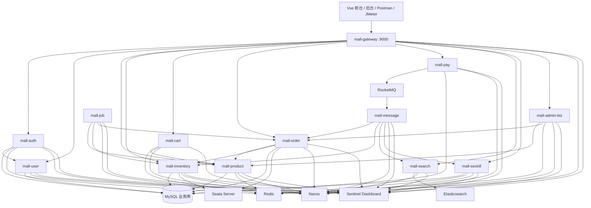
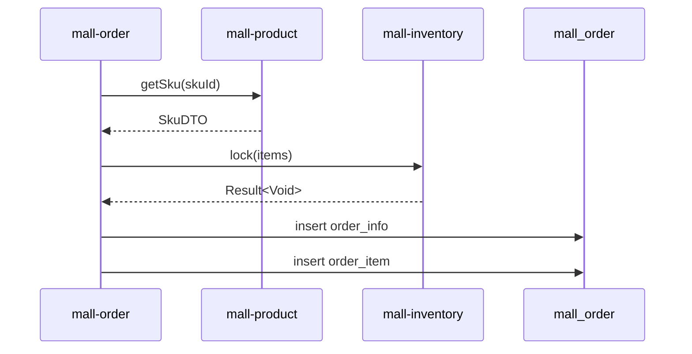
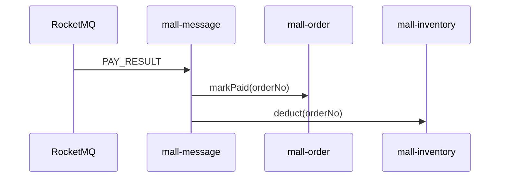
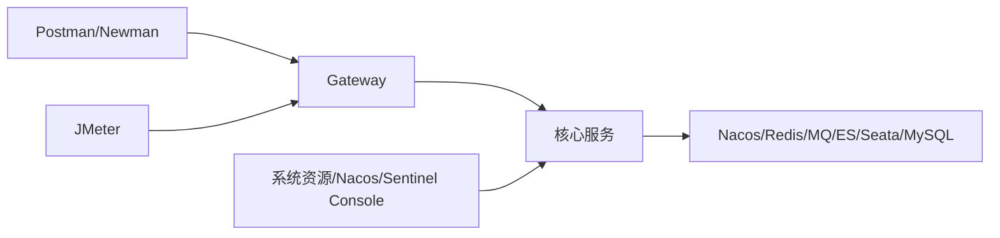

# MallCloud 架构设计说明

> 文档版本：v2.0
> 文档状态：生效
> 上位标准：`docs/PROJECT_STANDARD.md`
> 说明：本文只把仓库当前存在的能力描述为当前架构；尚未验证或尚未实现的内容单独标记。

---

## 1. 架构目标

MallCloud 采用 Spring Cloud Alibaba 微服务架构，面向课程期末项目，重点保证：

- 服务边界清晰；
- 一条交易主链路完整；
- 组件使用正确且可演示；
- 架构描述与代码一致；
- 故障、限流和性能测试可以复现；
- 不通过继续拆服务或增加中间件扩大项目规模。

---

## 2. 当前总体架构



说明：

- 图中连线表示代码或配置中存在的主要关系；
- `mall-message` 是消息消费者与业务分发服务，不是独立业务数据库服务；
- 当前不声明 Spring Boot Admin、Loki、Grafana、MySQL 主从、RocketMQ 多 Broker 等生产级能力已经部署。

---

## 3. 服务边界

| 服务 | 职责 | 数据所有权 |
|---|---|---|
| mall-gateway | 路由、JWT 校验、用户 Header 透传 | 无 |
| mall-auth | 账号认证、Token 生成和黑名单 | mall_auth、Redis |
| mall-user | 用户资料和收货地址 | mall_user |
| mall-product | 类目、SPU、SKU | mall_product |
| mall-inventory | 库存锁定、扣减和释放 | mall_inventory |
| mall-cart | 用户购物车 | Redis |
| mall-order | 订单和订单项 | mall_order |
| mall-pay | 支付记录和模拟支付结果 | mall_pay |
| mall-search | 商品搜索索引 | Elasticsearch |
| mall-seckill | 秒杀活动、请求和结果 | mall_seckill、Redis |
| mall-message | RocketMQ 消费和跨服务分发 | 无 |
| mall-admin-biz | 后台聚合查询 | 不直接拥有核心业务数据 |
| mall-job | 定时任务编排 | 不直接拥有核心业务数据 |

边界规则：

- 业务服务不得直接访问其他服务数据库；
- 跨服务同步调用使用 OpenFeign；
- 异步状态变化使用 RocketMQ；
- 聚合服务不得复制核心业务写逻辑；
- 后续不新增服务。

---

## 4. Gateway 与安全

### 4.1 路由

Gateway 统一监听 `9000` 端口，通过 `lb://服务名` 路由到 Nacos 中的实例。

核心路由：

| 路径 | 服务 |
|---|---|
| `/api/v1/auth/**` | mall-auth |
| `/api/v1/users/**` | mall-user |
| `/api/v1/products/**`、`/api/v1/categories/**` | mall-product |
| `/api/v1/inventory/**` | mall-inventory |
| `/api/v1/carts/**` | mall-cart |
| `/api/v1/orders/**` | mall-order |
| `/api/v1/pay/**` | mall-pay |
| `/api/v1/search/**` | mall-search |
| `/api/v1/seckill/**` | mall-seckill |
| `/api/v1/admin/**` | mall-admin-biz |

### 4.2 JWT 处理

当前 Gateway 的 `JwtAuthFilter`：

1. 判断请求路径是否在白名单；
2. 读取 `Authorization: Bearer <token>`；
3. 使用 HS512 密钥验证 Token；
4. 提取 `uid` 和 `roles`；
5. 向下游写入 `X-User-Id` 和 `X-User-Roles`。

当前白名单至少包括：

- 登录；
-验证码；
- Token 刷新；
- 用户注册；
- 商品、类目和搜索公共查询。

### 4.3 当前限制

- 当前未检出 `@PreAuthorize` 方法级授权实现；
- 角色权限主要依赖登录生成角色和业务逻辑；
- 文档不把方法级 RBAC 描述为已完成；
- 默认密钥仅用于开发，测试和生产必须由环境变量或 K8s Secret 注入。

---

## 5. Nacos 注册与配置

### 5.1 注册中心

每个服务使用 `spring.application.name` 注册到 Nacos。课程演示需要验证：

- 服务启动后出现健康实例；
- 服务停止后 Nacos 能感知下线；
- 服务恢复后重新注册。

### 5.2 配置中心

当前仓库同时存在本地 `application.yaml` 和 `deploy/nacos/*.yaml` 模板。后续整改需要统一：

- 环境变量名；
- Namespace；
- DataId；
- Group；
- `shared-configs` 或当前兼容的导入方式；
- 配置刷新方式。

所有 Nacos 配置必须使用合法 YAML。禁止使用 `--` 作为注释，统一改为 `#`。

### 5.3 配置优先级

最终优先级必须通过当前 Spring Cloud Alibaba 版本的实际运行验证后写入结果报告。未经验证，不在本文给出可能误导的绝对优先级结论。

### 5.4 热更新验收

建议选择一个无业务风险的参数，例如商品分页大小：

1. 查询当前值；
2. 在 Nacos 修改配置；
3. 不重启服务再次查询；
4. 保存修改前后截图和服务日志；
5. 在 `docs/FINAL_REPORT.md` 记录结果。

---

## 6. OpenFeign 调用

### 6.1 当前核心调用

| 调用方 | 被调用方 | 用途 |
|---|---|---|
| mall-auth | mall-user | 登录后查询用户资料 |
| mall-cart | mall-product | 查询购物车商品信息 |
| mall-order | mall-product | 查询 SKU 和价格 |
| mall-order | mall-inventory | 锁定库存 |
| mall-message | mall-order | 更新支付状态、创建秒杀订单 |
| mall-message | mall-inventory | 确认扣减或释放库存 |
| mall-message | mall-search | 同步搜索索引 |
| mall-message | mall-seckill | 回写秒杀结果 |
| mall-admin-biz | mall-order/product | 后台聚合 |
| mall-job | mall-order/product/inventory | 定时任务 |

### 6.2 返回值处理

调用方必须检查：

```java
if (result == null || !result.isSuccess()) {
    throw new BizException(ErrorCode.REMOTE_CALL_ERROR);
}
```

需要数据时还必须检查 `result.getData()` 是否为空。

### 6.3 降级策略

当前代码只有少量 Client 使用 `fallbackFactory`。后续只优先补充核心链路：

- `order → product`
- `order → inventory`
- `message → order`
- `message → inventory`

辅助查询不机械增加重复兜底。降级返回必须明确失败，不得伪造成功数据继续写业务状态。

### 6.4 超时与重试

- 连接超时和读取超时在服务配置中统一管理；
- 写操作默认不进行无条件自动重试；
- 重试只用于明确幂等的查询；
- 最终参数以实际压测和异常测试结果调整。

---

## 7. 订单与库存事务

### 7.1 当前普通下单流程

`mall-order` 当前执行：

1. 调用商品服务查询每个 SKU；
2. 按服务端价格计算金额；
3. 调用库存服务锁定库存；
4. 写入订单和订单项；
5. 返回订单号和模拟支付地址。

当前普通下单没有直接调用用户服务或支付服务。



### 7.2 Seata 边界

当前 `createOrder` 和秒杀订单创建方法存在 `@GlobalTransactional`。最终演示必须验证：

- 库存锁定成功、订单写入失败时库存是否回滚；
- 商品不存在或库存不足时订单是否未创建；
- `undo_log` 是否正确工作。

本文不把支付服务画入创建订单的 Seata 分支，因为当前代码没有该远程调用。

### 7.3 undo_log

每个参与 Seata AT 的业务库必须包含：

```sql
CREATE TABLE `undo_log` (
  `id` BIGINT AUTO_INCREMENT PRIMARY KEY,
  `branch_id` BIGINT NOT NULL,
  `xid` VARCHAR(100) NOT NULL,
  `context` VARCHAR(128) NOT NULL,
  `rollback_info` LONGBLOB NOT NULL,
  `log_status` INT NOT NULL,
  `log_created` DATETIME NOT NULL,
  `log_modified` DATETIME NOT NULL,
  UNIQUE KEY `ux_undo_log` (`xid`, `branch_id`)
);
```

数据库文档和 SQL 必须保持一致。

---

## 8. RocketMQ 消息设计

### 8.1 Topic

| Topic | 生产者 | 当前消费者 | 类型 | 用途 |
|---|---|---|---|---|
| ORDER_CREATED | order 或相关业务 | mall-message | 普通消息 | 订单创建通知；当前处理以日志或后续业务为准 |
| PAY_RESULT | pay | mall-message | 普通消息 | 更新订单和确认扣减库存 |
| SECKILL_REQUEST | seckill | mall-message | 普通消息 | 创建秒杀订单并回写结果 |
| STOCK_ROLLBACK | 订单取消相关业务 | mall-message | 普通消息 | 调用库存释放 |
| ES_SYNC | product | mall-message | 普通消息 | 转发搜索索引同步 |
| NOTIFY_MERCHANT | order | mall-message 或后台 | 普通/延时设计 | 当前需以实际 Listener 为准 |

### 8.2 支付结果消费



### 8.3 库存回滚消费

`StockRollbackListener` 位于 `mall-message`，收到消息后调用库存服务 `release(orderNo)`。

### 8.4 当前限制

- 仓库当前未检出 `@RocketMQTransactionListener`；
- 不将 `STOCK_ROLLBACK` 描述为事务消息；
- 消费幂等、失败重试和重复消息需要通过代码整改与测试确认；
- 不额外引入本地消息表，除非测试证明普通重试无法满足课程演示。

---

## 9. Sentinel

### 9.1 当前状态

项目已引入 Sentinel 相关依赖和 Dashboard 配置，并启用了基础 Web 过滤。当前 Java 代码未检出 `@SentinelResource`。

因此资源定义应按实际请求路径或后续明确添加的注解描述，不再把示例注解写成当前实现。

### 9.2 建议展示资源

只保留两个核心资源：

- 创建订单；
- 秒杀请求。

### 9.3 验收场景

- 正常请求低于阈值时成功；
- 秒杀逐级加压时出现受控限流；
- 下游超时或失败时快速返回明确错误；
- 系统没有因持续压力完全失去响应。

最终阈值必须来自 JMeter 测试，不在文档中预先虚构。

---

## 10. Redis

Redis 当前主要用于：

- Token 黑名单；
- 购物车；
- 商品或后台缓存；
- 秒杀库存、限购和结果状态；
- Gateway 限流相关能力。

设计原则：

- Key 必须带业务前缀；
- 缓存不能替代业务数据库真相；
- 秒杀原子操作使用 Lua 或原子命令；
- Redis 宕机后的行为按实际代码记录，不声明不存在的 DB 自动降级。

---

## 11. Elasticsearch

### 11.1 职责

`mall-search` 负责商品全文搜索。商品变更可通过 `ES_SYNC` 消息触发同步。

### 11.2 最小验收

- Elasticsearch 健康；
- 商品索引存在；
- 能搜索种子商品；
- 商品状态变化后能完成同步或手动重建；
- 保存查询请求和结果截图。

### 11.3 IK 分词器

仓库部署镜像是否包含 IK 插件必须实际验证。未安装时，不在文档中宣称 `ik_max_word` 已可用，可先使用标准分析器保证演示稳定。

---

## 12. 可观测性

当前最低可观测能力：

- `/actuator/health`；
- 服务日志；
- Nacos 服务列表；
- Sentinel Dashboard；
- RocketMQ Console；
- Zipkin 容器配置；
- JMeter 测试期间的 Docker 或操作系统资源数据。

以下内容仅为规划或可选方案：

- Spring Boot Admin Server；
- Prometheus + Grafana；
- Loki 日志平台；
- 生产级告警通知。

未经部署和验证，不进入答辩演示主流程。

---

## 13. 部署架构

### 13.1 当前正式路径

```text
Windows 11
  → PowerShell 启动 Docker 中间件
  → PowerShell 初始化数据库
  → IDE 启动核心微服务
  → Gateway 统一访问
```

### 13.2 当前实验性路径

- `docker-compose.all.yml`：尚未形成完整可构建链路；
- Kubernetes：当前只有部分中间件和 Gateway 示例；
- 以上不得描述为已完成的一键全栈部署。

---

## 14. 测试架构



测试结果统一存放：

```text
docs/test/
├── postman/
├── jmeter/
├── screenshots/
└── README.md
```

---

## 15. 架构决策原则

1. 不增加新的微服务；
2. 不增加与评分无直接关系的中间件；
3. 核心链路失败必须明确，不伪造成功兜底；
4. 只对核心 Feign 调用增加必要降级；
5. 只选择少量 Sentinel 资源演示；
6. 生产级设计与当前实现分开描述；
7. 精确性能数字只能来自实际报告；
8. 任何架构图必须能映射到代码或配置。

---

## 16. 后续整改顺序

1. 修复 Nacos YAML 和配置加载；
2. 验证所有核心服务注册；
3. 验证 Gateway JWT；
4. 打通普通下单和支付消息链路；
5. 验证 Seata 失败回滚；
6. 补核心 Feign 降级；
7. 完成 Sentinel 规则和异常测试；
8. 完成 Postman 与 JMeter 报告。
