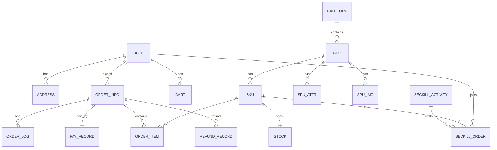

# MallCloud 数据库设计文档

> 版本：v1.0.0
> 数据库：MySQL 8.0
> 字符集：utf8mb4 / utf8mb4_unicode_ci

---

## 1. 数据库总览

| # | 库名             | 归属服务    | 主要表                                | 预估数据量 |
| - | ---------------- | ----------- | ------------------------------------- | ---------- |
| 1 | mall_auth        | mall-auth   | sys_user_auth                         | 1w         |
| 2 | mall_user        | mall-user   | user, address                         | 10w        |
| 3 | mall_product     | mall-product| category, spu, sku, spu_attr, spu_img | 1w         |
| 4 | mall_inventory   | mall-inventory | stock, stock_log                   | 10w        |
| 5 | mall_order       | mall-order  | order_info, order_item, order_log     | 100w       |
| 6 | mall_pay         | mall-pay    | pay_record, refund_record             | 100w       |
| 7 | mall_seckill     | mall-seckill| seckill_activity, seckill_order       | 1w         |

---

## 2. ER 总图



---

## 3. 库表结构

### 3.1 mall_auth

#### sys_user_auth

| 字段         | 类型         | 备注                                       |
| ------------ | ------------ | ------------------------------------------ |
| id           | BIGINT PK    |                                            |
| user_id      | BIGINT       | 关联 mall_user.user.id                      |
| identity_type| VARCHAR(16)  | PASSWORD / PHONE / WECHAT                  |
| identifier   | VARCHAR(64)  | 用户名/手机号/openId                       |
| credential   | VARCHAR(255) | BCrypt 加密                                |
| status       | TINYINT      | 1=正常 0=禁用                              |
| gmt_create   | DATETIME     |                                            |
| gmt_modified | DATETIME     |                                            |

索引：UNIQUE(identity_type, identifier)

### 3.2 mall_user

#### user

| 字段         | 类型         | 备注                              |
| ------------ | ------------ | --------------------------------- |
| id           | BIGINT PK    |                                   |
| username     | VARCHAR(64)  | UNIQUE                            |
| phone        | VARCHAR(20)  | UNIQUE                            |
| nickname     | VARCHAR(64)  |                                   |
| avatar       | VARCHAR(255) |                                   |
| email        | VARCHAR(128) |                                   |
| id_card      | VARCHAR(32)  | AES 加密                          |
| status       | TINYINT      | 1=正常                            |
| gmt_create   | DATETIME     |                                   |
| gmt_modified | DATETIME     |                                   |

#### address

| 字段         | 类型         | 备注                          |
| ------------ | ------------ | ----------------------------- |
| id           | BIGINT PK    |                               |
| user_id      | BIGINT       |                               |
| receiver     | VARCHAR(64)  |                               |
| phone        | VARCHAR(20)  |                               |
| province     | VARCHAR(32)  |                               |
| city         | VARCHAR(32)  |                               |
| district     | VARCHAR(32)  |                               |
| detail       | VARCHAR(255) |                               |
| is_default   | TINYINT      | 1=默认 0=否                   |
| gmt_create   | DATETIME     |                               |

索引：idx_user(user_id)

### 3.3 mall_product

#### category

| 字段         | 类型         | 备注                       |
| ------------ | ------------ | -------------------------- |
| id           | BIGINT PK    |                            |
| parent_id    | BIGINT       | 0=一级类目                 |
| name         | VARCHAR(64)  |                            |
| level        | TINYINT      | 1/2/3                      |
| icon         | VARCHAR(255) |                            |
| sort         | INT          |                            |
| status       | TINYINT      | 1=启用 0=禁用              |

索引：idx_parent(parent_id)

#### spu

| 字段            | 类型         | 备注                          |
| --------------- | ------------ | ----------------------------- |
| id              | BIGINT PK    |                               |
| name            | VARCHAR(255) |                               |
| description     | TEXT         |                               |
| main_image      | VARCHAR(255) |                               |
| category_id     | BIGINT       |                               |
| brand           | VARCHAR(64)  |                               |
| merchant_id     | BIGINT       | 商家 ID                        |
| status          | TINYINT      | 0=下架 1=上架 2=审核中         |
| sales           | INT          | 销量                          |
| view_count      | INT          | 浏览量                        |
| gmt_create      | DATETIME     |                               |

索引：idx_category(category_id), idx_merchant(merchant_id), idx_status(status)

#### sku

| 字段         | 类型         | 备注                          |
| ------------ | ------------ | ----------------------------- |
| id           | BIGINT PK    |                               |
| spu_id       | BIGINT       |                               |
| spec_json    | JSON         | {"颜色":"红","版本":"256G"}    |
| price        | DECIMAL(10,2)|                               |
| original_price | DECIMAL   |                               |
| image        | VARCHAR(255) |                               |
| weight       | INT          | 克                            |
| barcode      | VARCHAR(64)  |                               |
| status       | TINYINT      | 1=启用                        |

索引：idx_spu(spu_id)

#### spu_attr

| 字段      | 类型         | 备注                       |
| --------- | ------------ | -------------------------- |
| id        | BIGINT PK    |                            |
| spu_id    | BIGINT       |                            |
| attr_name | VARCHAR(64)  |                            |
| attr_value| VARCHAR(255) |                            |

#### spu_img

| 字段      | 类型         | 备注                       |
| --------- | ------------ | -------------------------- |
| id        | BIGINT PK    |                            |
| spu_id    | BIGINT       |                            |
| url       | VARCHAR(255) |                            |
| sort      | INT          |                            |
| is_main   | TINYINT      |                            |

### 3.4 mall_inventory

#### stock

| 字段         | 类型     | 备注                                  |
| ------------ | -------- | ------------------------------------- |
| id           | BIGINT PK|                                       |
| sku_id       | BIGINT   | UNIQUE                                |
| total        | INT      | 总库存                                |
| locked       | INT      | 预扣占用                              |
| available    | INT      | 可售 = total - locked                 |
| version      | INT      | 乐观锁                                |
| gmt_modified | DATETIME |                                       |

#### stock_log

| 字段       | 类型         | 备注                              |
| ---------- | ------------ | --------------------------------- |
| id         | BIGINT PK    |                                   |
| sku_id     | BIGINT       |                                   |
| change     | INT          | +入 -出                           |
| type       | VARCHAR(16)  | LOCK/UNLOCK/DEDUCT/ROLLBACK        |
| ref_no     | VARCHAR(64)  | 关联单号                          |
| remark     | VARCHAR(255) |                                   |
| gmt_create | DATETIME     |                                   |

索引：idx_sku(sku_id), idx_ref(ref_no)

### 3.5 mall_order

#### order_info

| 字段           | 类型          | 备注                                |
| -------------- | ------------- | ----------------------------------- |
| id             | BIGINT PK     |                                     |
| order_no       | VARCHAR(32)   | UNIQUE，业务流水号                  |
| user_id        | BIGINT        |                                     |
| merchant_id    | BIGINT        |                                     |
| total_amount   | DECIMAL(12,2) |                                     |
| pay_amount     | DECIMAL(12,2) |                                     |
| freight_amount | DECIMAL(12,2) |                                     |
| discount_amount| DECIMAL(12,2) |                                     |
| status         | TINYINT       | 0=待支付 1=已支付 2=已发货 3=已完成 4=已取消 5=已退款 |
| address_json   | JSON          | 收货地址快照                        |
| pay_deadline   | DATETIME      |                                     |
| remark         | VARCHAR(255)  |                                     |
| gmt_create     | DATETIME      |                                     |
| gmt_pay        | DATETIME      |                                     |
| gmt_modified   | DATETIME      |                                     |

索引：idx_user_status(user_id, status), idx_merchant_status(merchant_id, status), idx_create(gmt_create)

#### order_item

| 字段         | 类型          | 备注                          |
| ------------ | ------------- | ----------------------------- |
| id           | BIGINT PK     |                               |
| order_id     | BIGINT        |                               |
| order_no     | VARCHAR(32)   |                               |
| sku_id       | BIGINT        |                               |
| spu_id       | BIGINT        |                               |
| sku_image    | VARCHAR(255)  |                               |
| sku_name     | VARCHAR(255)  |                               |
| spec_json    | JSON          |                               |
| price        | DECIMAL(10,2) |                               |
| quantity     | INT           |                               |
| subtotal     | DECIMAL(12,2) |                               |

索引：idx_order(order_id), idx_sku(sku_id)

#### order_log

| 字段       | 类型         | 备注                          |
| ---------- | ------------ | ----------------------------- |
| id         | BIGINT PK    |                               |
| order_id   | BIGINT       |                               |
| from_status| TINYINT      |                               |
| to_status  | TINYINT      |                               |
| operator   | VARCHAR(64)  |                               |
| remark     | VARCHAR(255) |                               |
| gmt_create | DATETIME     |                               |

### 3.6 mall_pay

#### pay_record

| 字段         | 类型          | 备注                          |
| ------------ | ------------- | ----------------------------- |
| id           | BIGINT PK     |                               |
| pay_no       | VARCHAR(32)   | UNIQUE                        |
| order_no     | VARCHAR(32)   | UNIQUE                        |
| user_id      | BIGINT        |                               |
| pay_channel  | VARCHAR(16)   | ALIPAY/WECHAT                 |
| pay_amount   | DECIMAL(12,2) |                               |
| status       | TINYINT       | 0=待支付 1=成功 2=失败 3=关闭   |
| trade_no     | VARCHAR(64)   | 第三方流水号                  |
| notify_time  | DATETIME      |                               |
| gmt_create   | DATETIME      |                               |
| gmt_modified | DATETIME      |                               |

#### refund_record

| 字段         | 类型          | 备注                          |
| ------------ | ------------- | ----------------------------- |
| id           | BIGINT PK     |                               |
| refund_no    | VARCHAR(32)   | UNIQUE                        |
| order_no     | VARCHAR(32)   |                               |
| pay_no       | VARCHAR(32)   |                               |
| refund_amount| DECIMAL(12,2) |                               |
| reason       | VARCHAR(255)  |                               |
| status       | TINYINT       | 0=待审核 1=已退款 2=拒绝      |
| gmt_create   | DATETIME      |                               |

### 3.7 mall_seckill

#### seckill_activity

| 字段         | 类型          | 备注                          |
| ------------ | ------------- | ----------------------------- |
| id           | BIGINT PK     |                               |
| name         | VARCHAR(128)  |                               |
| sku_id       | BIGINT        |                               |
| seckill_price| DECIMAL(10,2) |                               |
| total_stock  | INT           |                               |
| limit_per_user | INT         | 默认 1                        |
| start_time   | DATETIME      |                               |
| end_time     | DATETIME      |                               |
| status       | TINYINT       | 0=未开始 1=进行中 2=已结束 3=取消 |

#### seckill_order

| 字段         | 类型         | 备注                          |
| ------------ | ------------ | ----------------------------- |
| id           | BIGINT PK    |                               |
| activity_id  | BIGINT       |                               |
| user_id      | BIGINT       |                               |
| sku_id       | BIGINT       |                               |
| order_no     | VARCHAR(32)  |                               |
| request_id   | VARCHAR(64)  | UNIQUE,防重                   |
| status       | TINYINT      | 0=排队 1=成功 2=失败 3=已退款  |
| gmt_create   | DATETIME     |                               |

索引：UNIQUE(activity_id, user_id), idx_request(request_id)

### 3.8 undo_log（每个业务库都要建）

```sql
CREATE TABLE `undo_log` (
  `id` BIGINT AUTO_INCREMENT PRIMARY KEY,
  `branch_id` BIGINT NOT NULL,
  `xid` VARCHAR(100) NOT NULL,
  `context` VARCHAR(128) NOT NULL,
  `rollback_info` LONGBLOB NOT NULL,
  `log_status` INT NOT NULL,
  `log_created` DATETIME,
  `log_modified` DATETIME,
  UNIQUE KEY `ux_undo_log` (`xid`, `branch_id`)
);
```

---

## 4. 索引设计原则

1. **高频查询字段建索引**：`user_id` / `order_no` / `status`；
2. **组合索引遵循最左前缀**：`(user_id, status, gmt_create)`；
3. **唯一索引前置业务唯一约束**：`order_no`、`pay_no`；
4. **不在频繁更新字段建索引**（如 `status` 变化频繁时考虑冗余字段）；
5. **字符串前缀索引**：`VARCHAR(255)` 类型的前 16 字符覆盖 80% 查询。

---

## 5. 数据迁移

- 使用 **init 脚本 + 迁移脚本** 管理版本：`db/init/00-create-databases.sql`（建库建表）；后续变更在 `db/migration/` 下补 `V{n}__xxx.sql`；
- 启动时自动执行；
- 兼容旧版：永远不修改已执行过的脚本，只能新增 V2、V3。

---

## 6. 种子数据

`db/init/seed.sql` 提供演示数据：
- 3 级类目共 30 个；
- 商家 5 个；
- SPU 100 个，SKU 300 个；
- 测试用户 10 个；
- 秒杀活动 3 场。

---

**—— 文档结束 ——**
