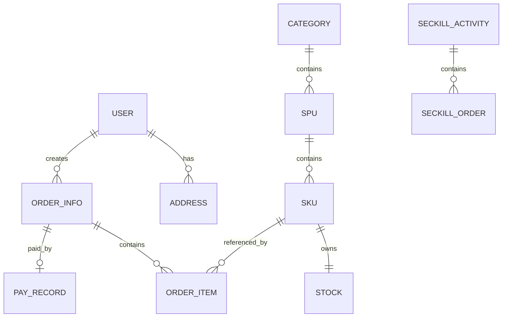

# MallCloud 数据库设计

> 文档版本：v2.0
> 数据库：MySQL 8.0+
> 字符集：utf8mb4
> 权威 DDL：`db/init/00-create-databases.sql`
> 演示数据：`db/init/seed.sql`

---

## 1. 设计原则

- 每个核心业务服务拥有独立业务库；
- 服务不得直接访问其他服务数据库；
- 跨服务操作通过 OpenFeign、RocketMQ 或 Seata；
- 表结构以 SQL 文件为最终事实来源；
- 本文不扩展新表，不为追求规模增加冗余数据模型；
- 演示数据量与设计容量分开描述。

---

## 2. 数据库总览

| 数据库 | 所属服务 | 主要表 |
|---|---|---|
| `mall_auth` | mall-auth | `sys_user_auth`、`undo_log` |
| `mall_user` | mall-user | `user`、`address`、`undo_log` |
| `mall_product` | mall-product | `category`、`spu`、`sku`、`spu_attr`、`spu_img`、`undo_log` |
| `mall_inventory` | mall-inventory | `stock`、`stock_log`、`undo_log` |
| `mall_order` | mall-order | `order_info`、`order_item`、`order_log`、`undo_log` |
| `mall_pay` | mall-pay | `pay_record`、`refund_record`、`undo_log` |
| `mall_seckill` | mall-seckill | `seckill_activity`、`seckill_order`、`undo_log` |
| `mall_seata` | Seata Server | `global_table`、`branch_table`、`lock_table`、`distributed_lock` |

> `mall_seata` 是 Seata Server 2.0.0 的 TC 协调器存储，与业务库 `undo_log`（AT 分支回滚日志）不同层级。权威 DDL 见 `db/init/00-create-databases.sql`。当前数据库基线只保留 `db/init/`，不再支持旧数据库环境升级。

实际表数量以初始化 SQL 执行结果为准，不在未验证时固定宣称总数。

---

## 3. 核心关系



微服务之间不建立数据库级外键。关联 ID 由业务逻辑维护。

---

## 4. 认证库 `mall_auth`

### 4.1 `sys_user_auth`

| 字段 | 类型 | 约束/说明 |
|---|---|---|
| `id` | BIGINT | 主键、自增 |
| `user_id` | BIGINT | 对应用户服务用户 ID |
| `identity_type` | VARCHAR(16) | PASSWORD/PHONE/WECHAT |
| `identifier` | VARCHAR(64) | 用户名、手机号或 openId |
| `credential` | VARCHAR(255) | BCrypt 密码摘要 |
| `status` | TINYINT | 1 正常，0 禁用 |
| `role` | VARCHAR(16) | USER/MERCHANT/ADMIN，默认 USER |
| `gmt_create` | DATETIME | 创建时间 |
| `gmt_modified` | DATETIME | 修改时间 |

唯一约束：`identity_type + identifier`。

说明：当前阶段将单一角色保存在认证记录中，登录签发 Token 时直接读取该字段；公开注册不接收角色参数，数据库默认角色为 USER。

---

## 5. 用户库 `mall_user`

### 5.1 `user`

保存用户名、手机号、昵称、头像、邮箱、身份证字段和状态。

重要约束：

- `username` 唯一；
- `phone` 唯一；
- `id_card` 字段仅表示预留敏感字段；代码未完成 AES 验证前，不宣称已加密落库。

### 5.2 `address`

保存收件人、手机号、省市区、详细地址和默认标记。

索引：`user_id`。

---

## 6. 商品库 `mall_product`

### 6.1 `category`

三级类目结构，使用 `parent_id` 和 `level` 表示层级。

### 6.2 `spu`

保存商品款型信息：

- 名称、描述、主图；
- 类目、品牌、商家；
- 上下架状态；
- 销量和浏览量。

### 6.3 `sku`

保存可售单元：

- `spu_id`；
- `spec_json`；
- 价格、原价、图片；
- 重量、条码、状态。

订单价格必须由商品服务返回，不能使用客户端金额。

### 6.4 `spu_attr` 与 `spu_img`

分别保存商品属性和图片。课程项目保留简单结构，不扩展复杂规格模板系统。

---

## 7. 库存库 `mall_inventory`

### 7.1 `stock`

| 字段 | 说明 |
|---|---|
| `sku_id` | SKU 唯一标识 |
| `total` | 总库存 |
| `locked` | 已锁定未确认库存 |
| `available` | 可售库存 |
| `version` | 乐观锁版本 |
| `gmt_modified` | 修改时间 |

库存状态必须满足：

```text
available >= 0
locked >= 0
total >= locked
```

### 7.2 `stock_log`

记录 LOCK、UNLOCK、DEDUCT、ROLLBACK 等库存变化，建议使用业务单号作为 `ref_no`。

后续测试应验证同一订单的重复扣减或释放不会造成库存重复变化。

---

## 8. 订单库 `mall_order`

### 8.1 `order_info`

保存：

- 订单号；
- 用户和商家 ID；
- 总金额、支付金额、运费和优惠；
- 订单状态；
- 地址快照；
- 支付截止时间；
- 创建、支付和修改时间。

当前状态：

| 值 | 含义 |
|---:|---|
| 0 | 待支付 |
| 1 | 已支付 |
| 2 | 已发货 |
| 3 | 已完成 |
| 4 | 已取消 |
| 5 | 已退款 |

### 8.2 `order_item`

保存 SKU、SPU、商品名称、规格、价格、数量和小计快照。

### 8.3 `order_log`

用于记录状态变化。若当前代码未写入完整日志，应标记为待完善，不通过新增复杂事件溯源扩大范围。

---

## 9. 支付库 `mall_pay`

### 9.1 `pay_record`

保存支付单号、订单号、用户、渠道、金额、状态和模拟第三方流水号。

### 9.2 `refund_record`

保留基础退款记录结构。退款不是本期核心验收链路，不继续扩展复杂审核和资金处理。

---

## 10. 秒杀库 `mall_seckill`

### 10.1 `seckill_activity`

保存活动、SKU、秒杀价、总库存、用户限购、时间和状态。

### 10.2 `seckill_order`

保存活动、用户、SKU、订单号、请求 ID 和处理状态。

关键约束：

- `request_id` 唯一或具备等价防重约束；
- 同一活动和用户不能重复成功；
- Redis 预扣结果与数据库结果必须通过测试验证。

---

## 11. Seata `undo_log`

所有参与 AT 事务的业务库统一使用：

```sql
CREATE TABLE `undo_log` (
  `id` BIGINT AUTO_INCREMENT PRIMARY KEY,
  `branch_id` BIGINT NOT NULL,
  `xid` VARCHAR(100) NOT NULL,
  `context` VARCHAR(128) NOT NULL,
  `rollback_info` LONGBLOB NOT NULL,
  `log_status` INT NOT NULL,
  `log_created` DATETIME NOT NULL,
  `log_modified` DATETIME NOT NULL,
  UNIQUE KEY `ux_undo_log` (`xid`, `branch_id`)
);
```

本文与 `00-create-databases.sql` 保持一致。

---

## 12. 索引原则

- 业务唯一键使用唯一索引，例如订单号、支付单号；
- 高频查询字段建立普通或联合索引；
- 联合索引按实际查询条件设计；
- 不为低频查询机械增加索引；
- 更新频繁的低区分度字段不单独建索引，除非查询证明有必要；
- 索引优化以慢查询和压测结果为依据。

---

## 13. 演示数据

当前 `db/init/seed.sql` 提供：

| 数据 | 数量 |
|---|---:|
| 用户 | 10 |
| 地址 | 3 |
| 类目 | 30 |
| SPU | 5 |
| SKU | 7 |
| 库存记录 | 7 |
| 秒杀活动 | 3 |

此前文档中的“100 SPU、300 SKU”不是当前演示数据，已废止。

演示数据只用于功能验证，不代表设计容量。

---

## 14. 初始化与验证

推荐使用：

```powershell
.\scripts\init-db.ps1
```

手动方式：

```powershell
mysql -h 127.0.0.1 -P 3306 -u root -p < .\db\init\00-create-databases.sql
mysql -h 127.0.0.1 -P 3306 -u root -p < .\db\init\seed.sql
```

PowerShell 对 `<` 重定向的行为与传统 shell 不同，实际执行时优先使用项目脚本或 MySQL `source`。

初始化后至少验证：

```sql
SELECT COUNT(*) FROM mall_user.user;
SELECT COUNT(*) FROM mall_product.spu;
SELECT COUNT(*) FROM mall_product.sku;
SELECT COUNT(*) FROM mall_inventory.stock;
SELECT COUNT(*) FROM mall_seckill.seckill_activity;
```

预期分别为 10、5、7、7、3。

---

## 15. 迁移规范

- `00-create-databases.sql` 用于全新环境初始化；
- 当前数据库基线只保留 `db/init/`，不再支持旧数据库环境升级；
- 不在业务代码中执行 DDL；
- 不手工修改共享演示数据库后不留记录；
- 当前项目不强制引入 Flyway/Liquibase，避免增加不必要依赖；
- 若后续结构频繁变化，再评估迁移工具。
