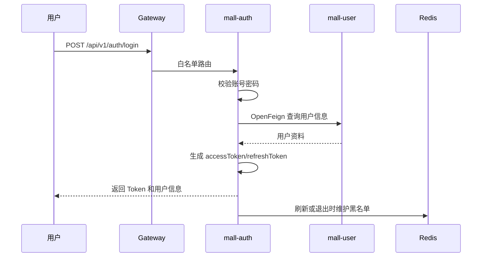
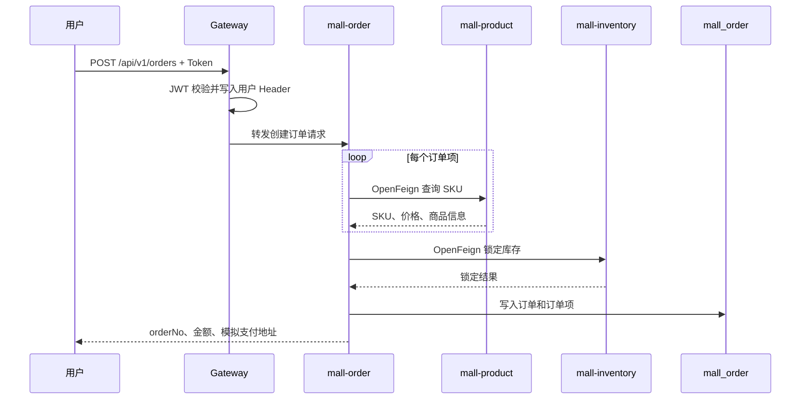
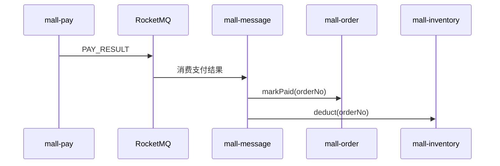
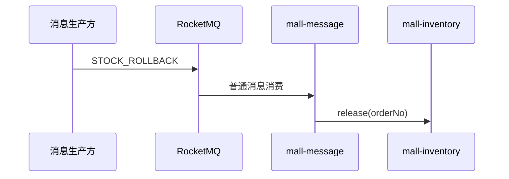
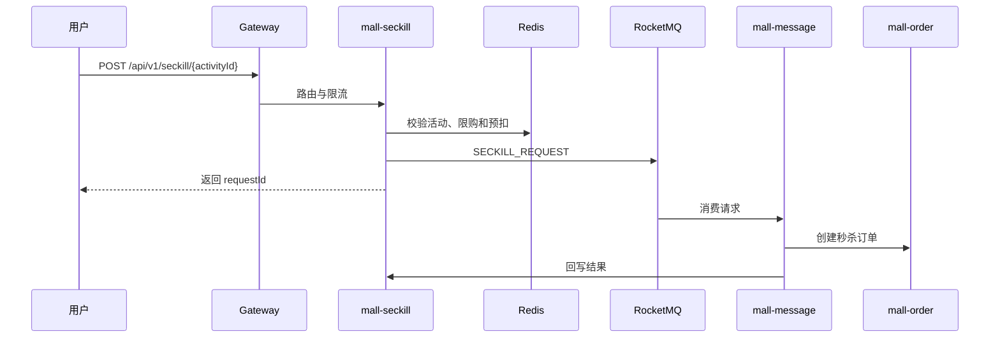

# MallCloud 需求规格说明书

> 文档版本：v2.1
> 文档状态：生效
> 项目类型：Spring Cloud 微服务期末大作业
> 团队规模：5 人
> 技术基线：Java 21 LTS、Spring Boot 3.2.4、Spring Cloud Alibaba 2023.0.1.0
> 上位标准：`docs/PROJECT_STANDARD.md`

---

## 1. 项目概述

MallCloud 是一个电商微服务课程项目，围绕用户、商品、购物车、订单、库存、支付、搜索和秒杀构建完整业务链路，并以可运行、可测试、可说明为主要交付目标。

项目不以业务功能数量为评价标准，不继续增加新的微服务或复杂业务模块。后续工作集中于：

1. 修复文档、配置和代码不一致；
2. 在 Java 21 下完成全模块构建；
3. 打通并验证核心交易链路；
4. 正确展示 Spring Cloud Alibaba 组件；
5. 建立可重复执行的测试与报告；
6. 完成稳定、可信的演示和答辩材料。

---

## 2. 项目目标

### 2.1 业务目标

```text
用户登录
  → 查询商品
  → 加入购物车
  → 创建订单
  → 商品服务返回 SKU 与价格
  → 库存服务锁定库存
  → 订单落库
  → 支付结果通过消息通知
  → 订单更新为已支付
  → 库存确认扣减
  → 用户查询订单
```

### 2.2 技术目标

- 使用 Nacos 完成服务注册和配置管理；
- 使用 Gateway 完成统一路由和 JWT 鉴权；
- 使用 OpenFeign 完成核心同步调用；
- 使用 Seata 2.0.0 验证订单与库存一致性；
- 使用 RocketMQ 解耦支付结果、秒杀和搜索同步；
- 使用 Sentinel 完成核心资源限流和异常降级；
- 使用 Redis 支撑购物车、缓存和秒杀；
- 使用 Elasticsearch 提供商品搜索；
- 使用 Postman/Newman 和 JMeter 形成测试证据。

### 2.3 质量目标

- 全部模块在 JDK 21 下编译通过；
- 核心服务启动并注册到 Nacos；
- 核心业务链路通过 Gateway 执行；
- 接口、配置、数据库和代码描述一致；
- 不存在虚构脚本、虚假性能数据和不可执行测试；
- 最终报告结论可追溯到命令、报告、截图或代码路径。

### 2.4 前端展示需求

MallCloud 最终交付必须提供浏览器可运行的前端完整演示系统。前端需覆盖游客、普通用户、商家和管理员的主要操作路径，并通过 Gateway 访问后端服务。前端不追求生产级商业复杂度，但必须覆盖当前项目主要业务链路、角色入口、异常提示。技术能力通过真实业务链路与测试报告体现，不再设置单独前端技术演示页。

---

## 3. 项目范围

### 3.1 必须完成

| 模块 | 功能 |
|---|---|
| 认证 | 登录、Token 刷新、退出 |
| 用户 | 用户资料、收货地址 |
| 商品 | 类目、SPU、SKU、商品查询 |
| 购物车 | 加入、查询、修改、删除 |
| 库存 | 锁定、确认扣减、释放、查询 |
| 订单 | 创建订单、查询订单、状态更新 |
| 支付 | 支付记录、模拟支付结果通知 |
| 网关 | 路由、JWT 校验、用户上下文透传 |
| 服务治理 | 注册发现、配置、限流或熔断演示 |
| 测试 | Postman、JMeter、异常场景和结果报告 |

### 3.2 技术亮点

| 模块 | 最小完成标准 |
|---|---|
| 搜索 | 能按关键字查询商品，并验证 ES 数据同步或初始化 |
| 秒杀 | 能验证限购、库存边界和 Sentinel 限流 |
| 消息 | 能消费支付结果并更新订单、库存状态 |
| 分布式事务 | 能验证订单创建失败时订单与锁定库存状态一致 |

### 3.3 辅助能力

- 后台只保留商品、订单和基础看板聚合；
- 定时任务只保留超时订单关闭和库存对账等必要任务；
- Kubernetes 只作为示例，不作为核心交付前提。

### 3.4 非目标

本期明确不实现：

- 真实支付宝或微信支付；
- 物流轨迹；
- 优惠券、满减和促销引擎；
- 推荐系统；
- 客服系统；
- 完整生产级监控告警平台；
- 多节点中间件高可用集群；
- 复杂补偿框架和无差别降级类；
- Java 24 或 Spring Boot 4.0 迁移。

---

## 4. 团队分工原则

团队固定为 5 人。最终姓名由小组填写，建议按以下职责划分：

| 角色 | 主要职责 |
|---|---|
| 成员 1：架构与网关 | 项目基线、Gateway、Nacos、公共模块 |
| 成员 2：用户与商品 | Auth、User、Product、Search |
| 成员 3：交易链路 | Cart、Order、Inventory、Seata |
| 成员 4：支付与异步 | Pay、Message、RocketMQ、Seckill |
| 成员 5：测试与交付 | Postman、JMeter、部署、报告、答辩 |

分工不代表模块完全隔离。核心链路联调、测试和答辩由全体成员共同负责。

---

## 5. 用户角色

| 角色 | 能力 |
|---|---|
| 游客 | 浏览类目、商品和搜索结果 |
| 普通用户 | 登录、购物车、下单、支付、查询订单 |
| 商家 | 商品和订单基础管理 |
| 管理员 | 课程演示所需的基础后台能力 |

演示账号统一密码为 `123456`。该密码仅用于本地课程环境。

---

## 6. 核心业务流程

### 6.1 登录流程



### 6.2 创建订单流程

创建订单阶段调用商品与库存服务，不直接调用支付服务。



### 6.3 支付结果处理



### 6.4 库存回滚



`STOCK_ROLLBACK` 按普通消息描述，不声明为 RocketMQ 事务消息。

### 6.5 秒杀流程



---

## 7. 服务划分

| 服务 | 端口 | 数据存储 | 核心职责 |
|---|---:|---|---|
| mall-gateway | 9100 | 无 | 路由、JWT、用户上下文 |
| mall-auth | 9101 | mall_auth、Redis | 认证与 Token |
| mall-user | 9102 | mall_user | 用户与地址 |
| mall-product | 9103 | mall_product、Redis | 商品与类目 |
| mall-inventory | 9104 | mall_inventory | 库存状态 |
| mall-cart | 9105 | Redis | 购物车 |
| mall-order | 9106 | mall_order | 订单 |
| mall-pay | 9107 | mall_pay | 支付记录和模拟通知 |
| mall-search | 9108 | Elasticsearch | 商品搜索 |
| mall-seckill | 9109 | mall_seckill、Redis | 秒杀 |
| mall-message | 9110 | 无 | MQ 消费和业务分发 |
| mall-admin-biz | 9111 | Redis | 后台聚合 |
| mall-job | 9112 | 无 | 定时任务 |

后续不增加新的服务。

---

## 8. 非功能需求

### 8.1 性能

- 正常并发基线为 50 用户；
- 负载测试提升到 75～150 用户；
- 压力测试逐级增加，最高阈值 500 用户；
- 目标 P95 小于 1 秒；
- 记录吞吐量、错误率、CPU 和内存。

以上是目标，不是当前实测结果。

### 8.2 安全

- 密码使用 BCrypt；
- JWT 使用 HS512；
- 测试和生产密钥通过环境变量或 Secret 注入；
- 演示账号密码 `123456` 仅用于本地测试；
- Gateway 白名单只开放必要公共接口；
- 未验证的方法级权限不得写成已实现。

### 8.3 可维护性

- 文档、接口、数据库和代码一致；
- 不引入不必要依赖；
- 核心逻辑有针对性测试；
- 关键配置可通过环境变量调整；
- 不提交个人绝对路径；
- Java 21 升级不附带无关代码重构。

---

## 9. 测试验收

### 9.1 接口测试

- 不少于 6 个核心接口；
- 总请求不少于 20 次；
- 包含正常和异常场景；
- 登录自动保存 Token；
- 创建订单自动保存 orderNo；
- 验证至少一次 OpenFeign 调用；
- 输出 Newman 或 Postman 报告。

### 9.2 服务治理

- 验证服务注册和下线感知；
- 验证 Gateway 路由；
- 验证无 Token、错误 Token、有效 Token；
- 验证至少一个核心下游异常场景。

### 9.3 负载与压力

- 商品查询：50 与 150 用户；
- 创建订单：记录 P95、吞吐和错误率；
- 秒杀：逐级增加到 500 用户；
- 保存 JTL、HTML 报告和资源截图。

### 9.4 版本验证

必须记录：

```powershell
java -version
mvn -version
docker inspect mall-seata --format '{{.Config.Image}}'
```

通过标准：

- Java 为 21；
- Maven 使用 JDK 21；
- Seata Server 镜像为 `seataio/seata-server:2.0.0`。

---

## 10. 当前交付状态

| 项目 | 状态 |
|---|---|
| Java 21 父 POM | 已配置待验证 |
| Seata 2.0.0 部署配置 | 已配置待验证 |
| 服务模块和基础代码 | 已实现待验证 |
| 核心交易链路 | 部分实现 |
| Gateway JWT | 已实现待验证 |
| Nacos 配置热更新 | 待验证 |
| RocketMQ 消息链路 | 部分实现 |
| Sentinel 规则与测试 | 部分实现 |
| Postman 最终集合 | 待重建 |
| JMeter 脚本与结果 | 未完成 |
| Docker 全栈 | 规划项 |
| Kubernetes 全栈 | 规划项 |

---

## 11. 完成标准

1. 核心链路可通过 Gateway 执行；
2. 全部模块在 Java 21 下构建成功；
3. Seata 2.0.0 启动、注册和回滚验证通过；
4. 关键服务在 Nacos 中健康注册；
5. Postman 满足接口和请求数量要求；
6. JMeter 完成负载、压力和异常测试；
7. Sentinel 和配置热更新各有一次有效演示；
8. 所有文档与代码一致；
9. 最终报告包含真实结果和已知限制；
10. 答辩不演示未验证功能。
