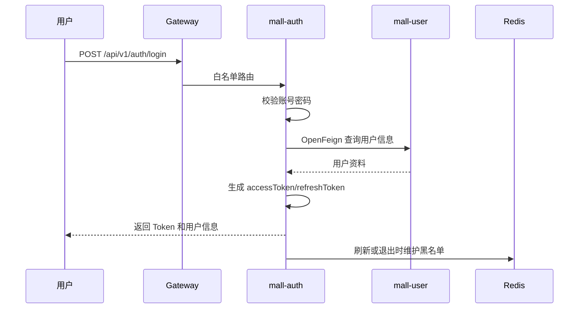
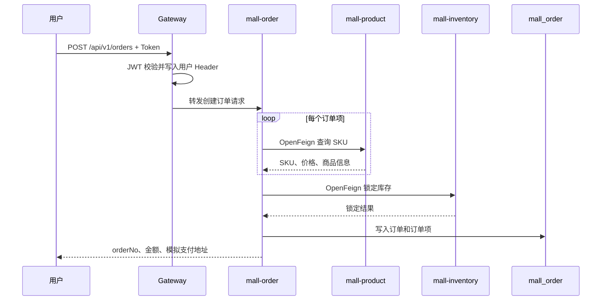
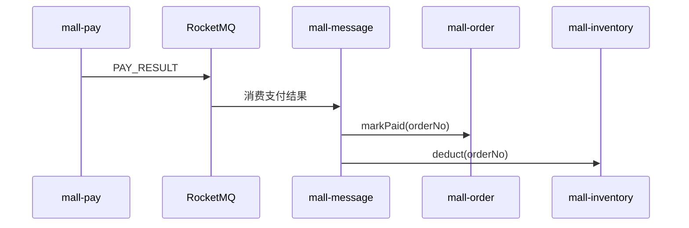
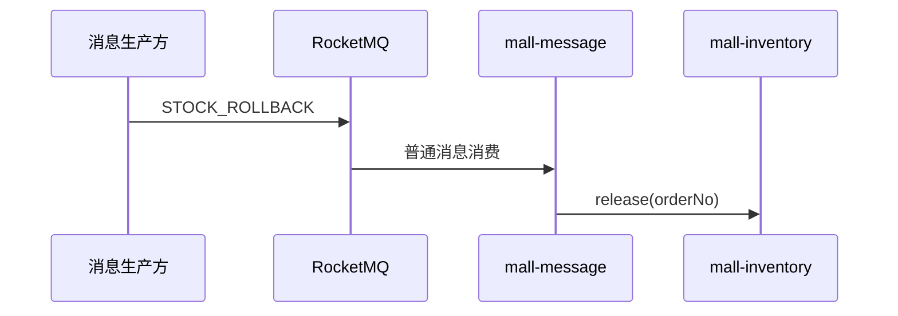
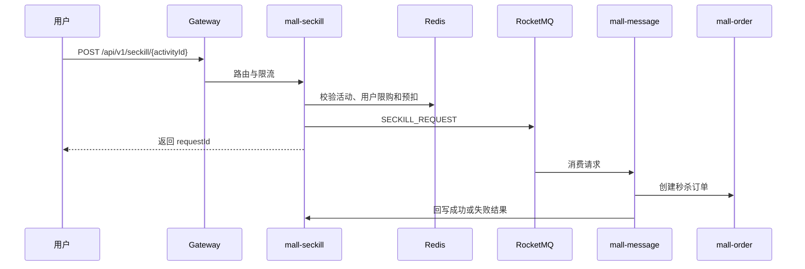

# MallCloud 需求规格说明书

> 文档版本：v2.0
> 文档状态：生效
> 项目类型：Spring Cloud 微服务期末大作业
> 团队规模：1～5 人
> 上位标准：`docs/PROJECT_STANDARD.md`

---

## 1. 项目概述

MallCloud 是一个电商微服务课程项目，围绕用户、商品、购物车、订单、库存、支付、搜索和秒杀构建完整业务链路，并以可运行、可测试、可说明为主要交付目标。

项目不以业务功能数量为评价标准，不继续增加新的微服务或复杂业务模块。后续工作集中于：

1. 修复现有文档、配置和代码不一致；
2. 打通并验证核心交易链路；
3. 正确展示 Spring Cloud Alibaba 组件；
4. 建立可重复执行的测试与报告；
5. 完成稳定、可信的演示和答辩材料。

---

## 2. 项目目标

### 2.1 业务目标

完成以下核心链路：

```text
用户登录
  → 查询商品
  → 加入购物车
  → 创建订单
  → 商品服务返回 SKU 与价格
  → 库存服务锁定库存
  → 订单落库
  → 支付结果通过消息通知
  → 订单更新为已支付
  → 库存确认扣减
  → 用户查询订单
```

### 2.2 技术目标

- 使用 Nacos 完成服务注册和配置管理；
- 使用 Gateway 完成统一路由和 JWT 鉴权；
- 使用 OpenFeign 完成核心同步调用；
- 使用 Seata 验证订单和库存的一致性；
- 使用 RocketMQ 解耦支付结果、秒杀和搜索同步；
- 使用 Sentinel 完成核心资源限流和异常降级；
- 使用 Redis 支撑缓存、购物车或秒杀；
- 使用 Elasticsearch 提供商品搜索；
- 使用 Postman/Newman 和 JMeter 形成完整测试证据。

### 2.3 质量目标

- 项目全部模块能够编译；
- 核心服务能够启动并注册到 Nacos；
- 核心业务链路能够通过 Gateway 执行；
- 接口、配置、数据库和代码描述保持一致；
- 不存在虚构脚本、虚假性能数据和无法执行的测试用例；
- 所有最终报告结论均可追溯到命令、报告、截图或代码路径。

---

## 3. 项目范围

### 3.1 必须完成

| 模块 | 功能 |
|---|---|
| 认证 | 登录、Token 刷新、退出 |
| 用户 | 用户资料、收货地址 |
| 商品 | 类目、SPU、SKU、商品查询 |
| 购物车 | 加入、查询、修改、删除 |
| 库存 | 锁定、确认扣减、释放、查询 |
| 订单 | 创建订单、查询订单、状态更新 |
| 支付 | 支付记录、模拟支付结果通知 |
| 网关 | 路由、JWT 校验、用户上下文透传 |
| 服务治理 | 注册发现、配置、限流或熔断演示 |
| 测试 | Postman、JMeter、异常场景和结果报告 |

### 3.2 技术亮点

| 模块 | 最小完成标准 |
|---|---|
| 搜索 | 能按关键字查询商品，并验证 ES 数据同步或初始化 |
| 秒杀 | 能验证限购、库存边界和 Sentinel 限流 |
| 消息 | 能消费支付结果并更新订单、库存状态 |
| 分布式事务 | 能验证订单创建失败时订单与锁定库存状态一致 |

### 3.3 辅助能力

- 后台只保留商品、订单和基础看板聚合；
- 定时任务只保留超时订单关闭和库存对账等必要任务；
- Kubernetes 只作为示例或扩展项，不作为核心交付前提。

### 3.4 非目标

本期明确不实现：

- 真实支付宝或微信支付；
- 物流轨迹；
- 优惠券、满减和促销引擎；
- 推荐系统；
- 客服系统；
- 完整生产级监控告警平台；
- 多节点中间件高可用集群；
- 复杂补偿框架和无差别降级类。

---

## 4. 用户角色

| 角色 | 能力 |
|---|---|
| 游客 | 浏览类目、商品和搜索结果 |
| 普通用户 | 登录、购物车、下单、支付、查询订单 |
| 商家 | 商品和订单基础管理 |
| 管理员 | 课程演示所需的基础后台能力 |

当前角色主要由登录账号规则生成。方法级角色鉴权尚未验证前，不将其描述为已完成能力。

---

## 5. 核心业务流程

### 5.1 登录流程



### 5.2 创建订单流程

该流程按当前代码事实描述。创建订单阶段调用商品和库存服务，不直接调用支付服务。



### 5.3 支付结果处理



支付结果消费者必须通过订单状态和库存状态保证重复消费不会重复扣减。该幂等性需要在后续代码整改和测试中验证。

### 5.4 库存回滚



当前 `STOCK_ROLLBACK` 按普通消息描述，不声明为 RocketMQ 事务消息。

### 5.5 秒杀流程



---

## 6. 服务划分

| 服务 | 端口 | 数据存储 | 核心职责 |
|---|---:|---|---|
| mall-gateway | 9000 | 无 | 路由、JWT、用户上下文 |
| mall-auth | 9001 | mall_auth、Redis | 认证与 Token |
| mall-user | 9002 | mall_user | 用户与地址 |
| mall-product | 9003 | mall_product、Redis | 商品与类目 |
| mall-inventory | 9004 | mall_inventory | 库存状态 |
| mall-cart | 9005 | Redis | 购物车 |
| mall-order | 9006 | mall_order | 订单 |
| mall-pay | 9007 | mall_pay | 支付记录和模拟通知 |
| mall-search | 9008 | Elasticsearch | 商品搜索 |
| mall-seckill | 9009 | mall_seckill、Redis | 秒杀 |
| mall-message | 9010 | 无 | MQ 消费和业务分发 |
| mall-admin-biz | 9011 | Redis | 后台聚合 |
| mall-job | 9012 | 无 | 定时任务 |

后续不增加新的服务。若辅助服务功能不完整，优先补核心链路，不通过新增服务解决。

---

## 7. 功能需求

### 7.1 认证与用户

- 用户可以使用账号密码登录；
- 登录成功返回 accessToken、refreshToken 和用户信息；
- refreshToken 可换取新 Token；
- 退出时 Token 可加入黑名单；
- 用户可以查询和维护基本资料、地址。

### 7.2 商品与搜索

- 游客和用户可查询商品列表、详情和类目树；
- 商品数据按 SPU/SKU 管理；
- 商品搜索支持关键字和基础筛选；
- 搜索同步失败时记录明确错误，不额外构建复杂补偿平台。

### 7.3 购物车

- 用户可以新增、查询、修改和删除购物车项；
- 购物车数据以用户为隔离维度；
- 创建订单时不得信任客户端价格。

### 7.4 订单与库存

- 创建订单时由商品服务返回实时 SKU 和价格；
- 创建订单前锁定库存；
- 库存不足时不创建订单；
- 订单创建失败时必须验证库存是否回滚；
- 支付成功后更新订单状态并确认扣减库存；
- 订单取消或超时后释放锁定库存。

### 7.5 支付

- 课程项目采用模拟支付；
- 不接入真实第三方渠道；
- 支付结果通过 RocketMQ 通知；
- 同一支付结果重复消费不能重复改变业务状态。

### 7.6 秒杀

- 校验活动时间和状态；
- 校验用户购买上限；
- 使用 Redis 完成快速库存判断；
- 使用 Sentinel 限制突发流量；
- 异步创建订单并提供结果查询。

---

## 8. 非功能需求

### 8.1 性能

课程目标：

- 正常并发基线为 50 用户；
- 负载测试提升到 75～150 用户；
- 压力测试逐级增加，最高阈值 500 用户；
- 目标 P95 小于 1 秒；
- 记录吞吐量和错误率。

以上是测试目标，不是当前实测结果。最终数值以 `docs/test/` 中的报告为准。

### 8.2 安全

- 密码使用 BCrypt；
- JWT 使用 HS512；
- 测试和生产密钥必须由环境变量或 Secret 注入；
- Gateway 白名单只开放必要公共接口；
- 当前未验证的方法级权限不得写成已实现。

### 8.3 可维护性

- 文档、接口、数据库和代码一致；
- 不引入不必要依赖；
- 核心逻辑有针对性测试；
- 关键配置可通过环境变量调整；
- 不提交个人绝对路径。

### 8.4 可观测性

最低要求：

- Actuator 健康检查；
- 服务关键日志；
- Sentinel Dashboard；
- Nacos 服务列表；
- JMeter 运行期间记录 CPU 和内存。

Spring Boot Admin、Loki、Grafana 等未实际部署时只作为可选方案。

---

## 9. 测试验收

### 9.1 接口功能测试

- 不少于 6 个核心接口；
- 总请求不少于 20 次；
- 包含正常和异常场景；
- 登录自动保存 Token；
- 创建订单自动保存 orderNo；
- 验证至少一次 OpenFeign 调用；
- 输出 Newman 或 Postman 报告。

### 9.2 服务治理测试

- 验证服务注册和下线感知；
- 验证 Gateway 路由；
- 验证无 Token、错误 Token、有效 Token；
- 验证至少一个核心下游异常场景。

### 9.3 负载与压力测试

- 商品查询：50 与 150 用户；
- 创建订单：记录 P95、吞吐和错误率；
- 秒杀：逐级增加到 500 用户；
- 保存 JTL 和 HTML 报告；
- 不使用未执行的精确性能数据。

### 9.4 异常测试

至少验证：

- 库存不足；
- 下游服务停止或超时；
- Sentinel 限流或熔断；
- Nacos 配置热更新；
- 重复支付消息或重复库存操作。

---

## 10. 当前交付状态

| 项目 | 状态 |
|---|---|
| 服务模块和基础代码 | 已实现待验证 |
| 核心接口与数据库 | 已实现待验证 |
| 核心交易链路 | 部分实现 |
| Gateway JWT | 已实现待验证 |
| Nacos 配置热更新 | 待验证 |
| Seata 一致性 | 待验证 |
| RocketMQ 消息链路 | 部分实现 |
| Sentinel 规则与测试 | 部分实现 |
| Postman 最终集合 | 待重建 |
| JMeter 脚本与结果 | 未完成 |
| Docker 全栈 | 规划项 |
| Kubernetes 全栈 | 规划项 |

---

## 11. 完成标准

项目达到期末交付标准需要同时满足：

1. 核心链路可通过 Gateway 执行；
2. 关键服务在 Nacos 中健康注册；
3. Postman 测试满足接口和请求数量要求；
4. JMeter 完成负载、压力和异常测试；
5. Sentinel 和配置热更新至少各有一次有效演示；
6. 所有文档与代码一致；
7. 最终报告包含真实结果和已知限制；
8. 答辩不演示未验证功能。
