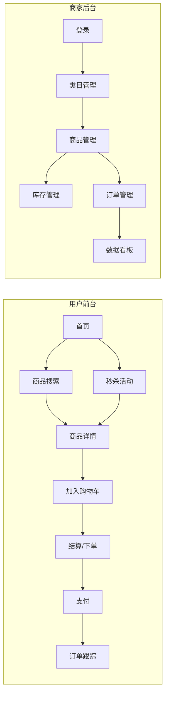
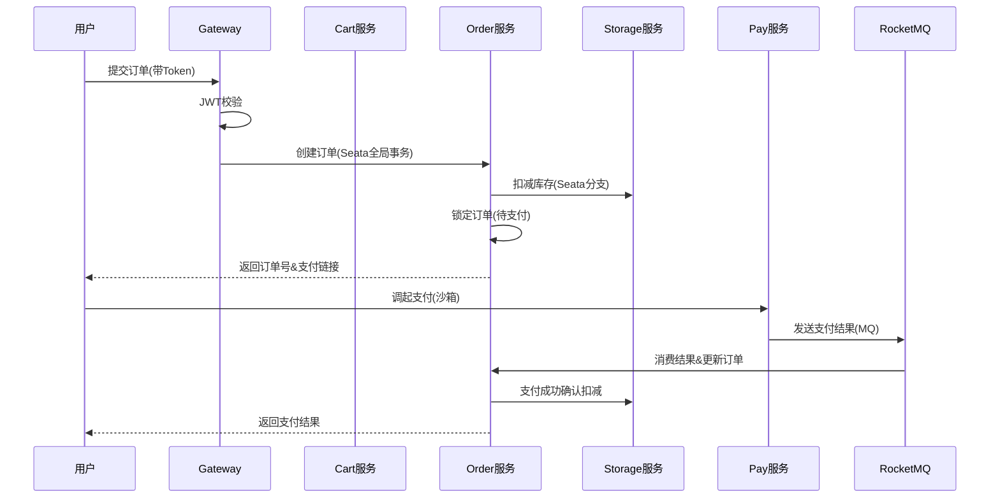
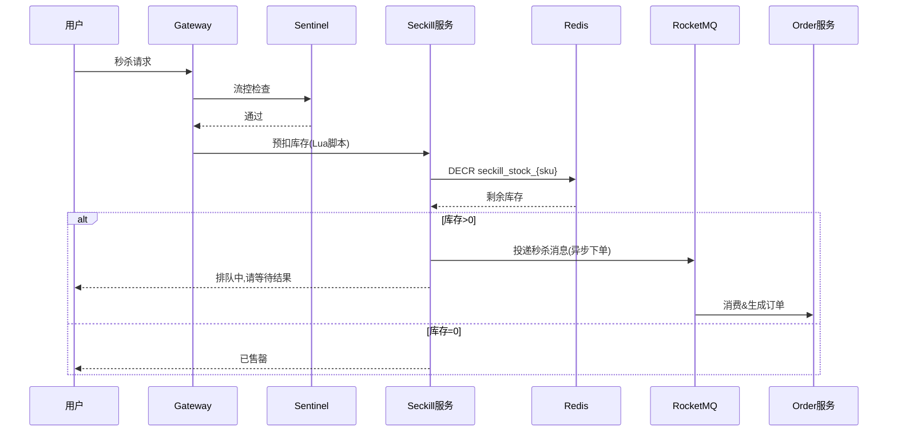
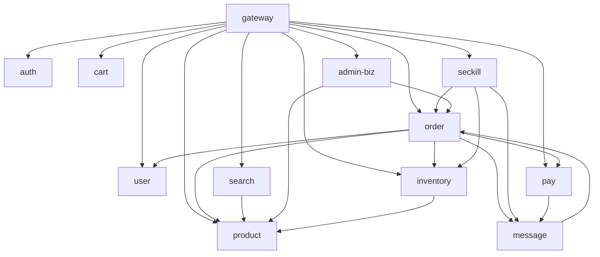
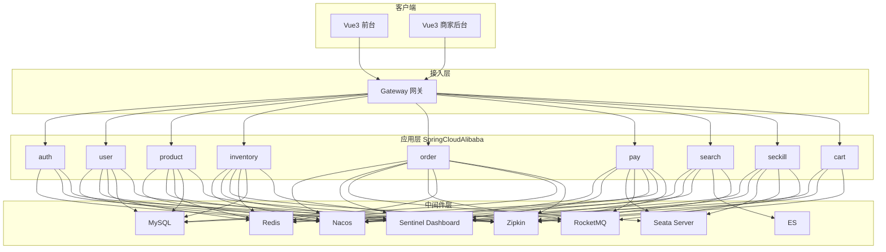
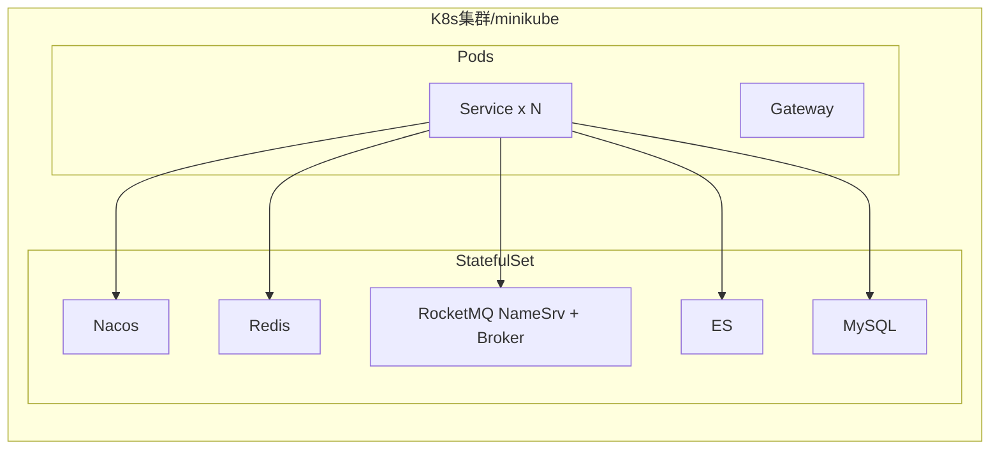

# 电商商城微服务项目 —— 需求规格说明书（PRD）

> 项目代号：**MallCloud**（微商城）
> 文档版本：v1.0.0
> 编写日期：2026-06-06
> 适用课程：微服务架构期末大作业
> 团队规模：4 人
> 文档状态：评审稿

---

## 文档信息

| 项目     | 内容                           |
| -------- | ------------------------------ |
| 项目名称 | MallCloud 微商城                |
| 文档版本 | v1.0.0                         |
| 编写人员 | 张三、李四、王五、赵六           |
| 评审人员 | 全体成员 + 指导老师             |
| 密级     | 课程内部                       |
| 存放路径 | `/docs/PRD.md`                 |

### 修订记录

| 版本 | 日期       | 修订人 | 修订内容       |
| ---- | ---------- | ------ | -------------- |
| v0.1 | 2026-03-01 | 张三   | 初稿，业务概述  |
| v0.5 | 2026-04-15 | 李四   | 补充微服务架构  |
| v0.9 | 2026-05-20 | 王五   | 补充接口与库表  |
| v1.0 | 2026-06-06 | 赵六   | 定稿，待评审    |

---

## 1. 项目概述

### 1.1 项目背景

随着电商业务的快速发展，传统单体架构在面对高并发、海量数据和复杂业务时暴露出扩展性差、发布周期长、容错能力弱等痛点。本项目以"高并发电商商城"为业务场景，基于 **Spring Cloud Alibaba** 全家桶构建一套完整的微服务系统，作为微服务架构课程的综合性实践。

### 1.2 项目目标

- 构建一个**可演示、可测试、可扩展**的电商微服务系统；
- 覆盖**注册中心、配置中心、网关、服务调用、熔断限流、分布式事务、消息队列、缓存、搜索、链路追踪**等微服务核心组件；
- 实现**用户前台 + 商家后台**双端，覆盖商品、订单、支付、库存、搜索、秒杀等核心业务；
- 通过 **Postman / JMeter / Sentinel Dashboard** 完成接口测试、负载测试、压力测试和异常场景验证；
- 沉淀一套基于 **Docker Compose + Kubernetes(minikube)** 的容器化部署方案。

### 1.3 项目价值

1. **教学价值**：完整呈现微服务架构在真实业务中的落地过程；
2. **工程价值**：可作为后续课程设计、毕业设计的脚手架；
3. **展示价值**：秒杀、分布式事务、ES 搜索等亮点在答辩中具备区分度。

### 1.4 术语与缩略语

| 术语      | 解释                                                         |
| --------- | ------------------------------------------------------------ |
| Nacos     | 阿里巴巴开源的注册中心 + 配置中心                              |
| Sentinel  | 流量控制、熔断降级组件                                        |
| Seata     | 阿里巴巴开源的分布式事务解决方案（AT 模式）                   |
| Gateway   | Spring Cloud 官方网关                                         |
| OpenFeign | 声明式 HTTP 客户端                                            |
| RocketMQ  | 阿里开源消息队列                                              |
| ES        | Elasticsearch 全文检索引擎                                    |
| JWT       | JSON Web Token                                                |
| P95       | 95% 请求响应时间分位值                                        |
| QPS       | 每秒请求数                                                    |
| SKU       | 库存单元（商品的最小销售单位）                                 |
| SPU       | 标准化产品单元（商品款型）                                     |

---

## 2. 项目目标与非目标

### 2.1 In-Scope（项目范围内）

- 用户体系：注册、登录、JWT 鉴权、地址管理；
- 商品体系：类目、SPU/SKU、上下架、库存、ES 搜索；
- 交易体系：购物车、下单、支付、订单状态机、退款；
- 秒杀体系：限时活动、Redis 预扣、限流、消息异步下单；
- 商家后台：类目管理、商品管理、订单管理、数据看板；
- 监控运维：Nacos 服务治理、Sentinel 限流、链路追踪、日志聚合。

### 2.2 Out-of-Scope（项目范围外）

- 物流配送（仅在订单中维护物流单号字段，不做轨迹查询）；
- 客服 IM（不接入第三方客服 SDK）；
- 跨境支付（仅支持人民币沙箱支付）；
- 推荐算法（首页推荐仅做"按销量/按上架时间"排序）。

---

## 3. 角色与用户画像

| 角色   | 描述                            | 主要诉求                       |
| ------ | ------------------------------- | ------------------------------ |
| 普通用户 | 浏览器访问前台，进行购物         | 浏览快、下单稳、支付安全       |
| 商家用户 | 登录后台，运营商品和订单         | 简单易用、数据可视             |
| 游客   | 未登录用户                       | 浏览商品、注册                 |
| 管理员  | 系统管理员（超级商家）           | 类目管理、用户管理             |
| 运维人员 | 部署和监控系统                  | 服务可观测、故障可定位         |

---

## 4. 业务架构

### 4.1 业务全景图



### 4.2 核心业务流程

#### 4.2.1 下单支付流程



#### 4.2.2 秒杀流程



---

## 5. 功能需求

### 5.1 功能模块总览

| 一级模块 | 二级模块       | 优先级 | 负责成员 |
| -------- | -------------- | ------ | -------- |
| 用户中心 | 注册/登录/资料 | P0     | 张三     |
| 商品中心 | 类目/商品/搜索 | P0     | 李四     |
| 交易中心 | 购物车/订单/支付 | P0   | 王五     |
| 库存中心 | 库存预扣/对账  | P0     | 王五     |
| 秒杀中心 | 活动/限流/排队 | P1     | 王五     |
| 商家后台 | 类目/商品/订单 | P1     | 赵六     |
| 系统管理 | 监控/日志/配置 | P1     | 赵六     |

### 5.2 用户中心

| 功能   | 描述                                       | 入参                          | 出参             |
| ------ | ------------------------------------------ | ----------------------------- | ---------------- |
| 注册   | 用户名/手机号 + 密码 + 短信验证码          | username, phone, code, pwd    | userId           |
| 登录   | 账号密码登录，返回 JWT                     | username, pwd                 | token, userInfo  |
| 刷新   | 用 refreshToken 换 accessToken            | refreshToken                  | newToken         |
| 资料   | 查看/修改昵称、头像、邮箱                   | userId                        | UserDTO          |
| 地址   | CRUD 收货地址                               | userId, addressDTO            | List<Address>    |
| 实名   | 上传身份证号（仅订单详情使用）              | idCard                        | success          |

### 5.3 商品中心

| 功能   | 描述                                       | 备注                          |
| ------ | ------------------------------------------ | ----------------------------- |
| 类目   | 三级类目树，支持增删改查                   | 缓存到 Redis                  |
| SPU    | 商品款型，含主图、详情图、规格参数         | 商家后台维护                  |
| SKU    | 最小销售单位，含价格、库存、规格值         | 与库存服务同步                |
| 上下架 | 商家操作，上架后同步到 ES                  | 状态机                        |
| 搜索   | 支持关键字、类目、价格区间、排序           | ES 全文检索 + 高亮            |

### 5.4 交易中心

| 功能     | 描述                                   | 备注                            |
| -------- | -------------------------------------- | ------------------------------- |
| 购物车   | 加车、改数量、删除、选中状态           | Redis Hash 存储                 |
| 预下单   | 校验库存、计算价格                     | 调用库存服务                    |
| 下单     | Seata 分布式事务                       | 订单-库存-支付                  |
| 支付     | 调起支付宝/微信沙箱                    | 异步通知 + MQ                   |
| 取消订单 | 超时未支付自动取消，库存回滚            | 延时消息                        |
| 退款     | 仅支持已付款未发货订单                  | 调用支付服务退款                |
| 订单列表 | 按状态/时间筛选                        | 分页 + 游标                     |

### 5.5 库存中心

| 功能     | 描述                                   |
| -------- | -------------------------------------- |
| 预扣     | 锁定库存（占用未付款订单）              |
| 扣减     | 支付成功后真正扣减                      |
| 回滚     | 取消订单时释放锁定                      |
| 库存同步 | 定时任务：Redis 库存与 MySQL 对账       |
| 库存预警 | 低于阈值时通知商家                      |

### 5.6 秒杀中心

| 功能     | 描述                                   |
| -------- | -------------------------------------- |
| 活动管理 | 商家配置秒杀场次、起止时间、SKU、价格   |
| 限流     | Sentinel QPS 限流 + 用户级滑动窗口     |
| 防刷     | 同一用户活动期间最多购买 1 件           |
| 预扣     | Redis Lua 原子扣减                      |
| 排队     | MQ 异步下单，轮询获取结果               |
| 数据统计 | 实时销量、转化率、热力榜                |

### 5.7 商家后台

| 功能     | 描述                                   |
| -------- | -------------------------------------- |
| 登录     | 单独的 merchant 角色 JWT                |
| 类目管理 | 维护三级类目                            |
| 商品管理 | 上下架、库存调整、价格修改              |
| 订单管理 | 查看本店订单，发货                      |
| 数据看板 | 日订单量、销售额、热销 TOP10（图表）    |

---

## 6. 微服务架构设计

### 6.1 微服务拆分原则

- **单一职责**：一个服务对应一个领域能力；
- **独立部署**：每个服务可独立打包、发布、伸缩；
- **数据隔离**：每个服务独占自己的数据库；
- **高内聚低耦合**：跨服务调用通过 OpenFeign，禁止循环依赖。

### 6.2 微服务清单

| 序号 | 服务名                | 端口 | 数据库           | 职责             |
| ---- | --------------------- | ---- | ---------------- | ---------------- |
| 1    | mall-gateway          | 9000 | -                | 网关、JWT 鉴权   |
| 2    | mall-auth             | 9001 | mall_auth        | 登录、Token 颁发  |
| 3    | mall-user             | 9002 | mall_user        | 用户/地址         |
| 4    | mall-product          | 9003 | mall_product     | SPU/SKU/类目      |
| 5    | mall-inventory        | 9004 | mall_inventory   | 库存             |
| 6    | mall-cart             | 9005 | Redis            | 购物车           |
| 7    | mall-order            | 9006 | mall_order       | 订单             |
| 8    | mall-pay              | 9007 | mall_pay         | 支付             |
| 9    | mall-search           | 9008 | ES               | 全文检索         |
| 10   | mall-seckill          | 9009 | Redis + MySQL    | 秒杀             |
| 11   | mall-message          | 9010 | -                | MQ 生产/消费封装  |
| 12   | mall-admin-biz        | 9011 | -                | 后台聚合服务     |
| 13   | mall-job              | 9012 | -                | 定时任务         |

### 6.3 服务依赖关系



### 6.4 公共组件

| 模块            | 用途                                   |
| --------------- | -------------------------------------- |
| mall-common     | 公共响应体、异常、工具类、常量           |
| mall-common-mybatis | MyBatis-Plus + 分页插件             |
| mall-common-redis | Redis 序列化、分布式锁封装              |
| mall-common-mq  | RocketMQ 生产/消费模板                  |
| mall-common-es  | ES 客户端封装                           |
| mall-common-security | JWT 工具、Security 配置           |
| mall-common-sentinel | Sentinel 规则加载                    |

---

## 7. 技术架构

### 7.1 技术选型

| 类别       | 选型                          | 版本       | 说明                          |
| ---------- | ----------------------------- | ---------- | ----------------------------- |
| 语言       | Java                          | 17         | LTS                           |
| 框架       | Spring Boot                   | 3.2.x      | 基座                          |
| 微服务     | Spring Cloud                  | 2023.0.x   | 与 Boot 3.2 对齐              |
| 微服务     | Spring Cloud Alibaba          | 2023.0.1.x | Alibaba 组件                  |
| 注册/配置  | Nacos                         | 2.3.x      | 注册 + 配置中心                |
| 网关       | Spring Cloud Gateway          | 4.x        | 响应式网关                    |
| 服务调用   | OpenFeign                    | 4.x        | 声明式 HTTP                   |
| 熔断限流   | Sentinel                      | 1.8.x      | 限流、熔断、热点、系统保护      |
| 分布式事务 | Seata                         | 1.8.x      | AT 模式                       |
| 消息队列   | RocketMQ                      | 5.x        | 事务消息、延时消息              |
| 缓存       | Redis                         | 7.x        | 缓存、分布式锁、限流计数        |
| 搜索       | Elasticsearch                 | 8.x        | 全文检索                      |
| 数据库     | MySQL                         | 8.x        | 业务库                        |
| ORM        | MyBatis-Plus                  | 3.5.x      | 国产 ORM                      |
| 安全       | Spring Security + JWT         | -          | 统一鉴权                      |
| 链路追踪   | Micrometer Tracing + Zipkin   | -          | 可选 SkyWalking                |
| 监控       | Spring Boot Admin             | 3.x        | 服务监控                      |
| 日志       | Logback + Loki                | -          | ELK 替代方案                  |
| CI/CD      | Docker + K8s                  | -          | minikube 部署                  |
| 前端       | Vue 3 + Vite + Element Plus   | -          | 用户前台 + 商家后台            |
| 测试       | Postman / JMeter              | -          | 接口/性能/压力测试              |

### 7.2 整体架构图



### 7.3 中间件部署拓扑



---

## 8. 非功能性需求

### 8.1 性能指标

| 指标               | 目标值                          | 备注                            |
| ------------------ | ------------------------------- | ------------------------------- |
| 普通接口 P95       | < 800 ms                        | 首页、详情、列表                |
| 下单 P95           | < 1.5 s                         | 含 Seata 分布式事务             |
| 秒杀 P95           | < 1.5 s                         | 含 MQ 排队                      |
| 系统吞吐量         | ≥ 500 QPS（单机单服务）          | JMeter 验证                     |
| 错误率             | < 0.5%（正常负载）              | -                                |
| 错误率             | < 5%（超载/压测）                | Sentinel 限流保护下              |

### 8.2 可用性

- 目标 **99.9%**（SLA）；
- 单服务故障不影响其他服务（熔断降级）；
- Nacos 集群部署，至少 2 个节点；
- RocketMQ 至少 2 主 2 从。

### 8.3 安全

- 全站 HTTPS（部署时由 Ingress 提供证书）；
- 网关统一 JWT 校验，刷新 Token 机制；
- 敏感数据（密码、身份证）BCrypt/AES 加密；
- SQL 注入：MyBatis 参数化 + 严格白名单；
- XSS：前端 Vue v-html 严格白名单；
- CSRF：JWT 在 Header 而非 Cookie。

### 8.4 扩展性

- 微服务可独立水平扩容；
- RocketMQ 消费端可动态调整线程数；
- ES 可水平扩节点；
- 配置中心支持 Profile 隔离（dev/test/prod）。

### 8.5 可观测性

- 全链路 traceId 透传（Micrometer + Zipkin）；
- 统一日志格式 `traceId | spanId | level | service | msg`；
- Spring Boot Admin 服务健康监控；
- Sentinel Dashboard 实时规则。

---

## 9. 接口设计规范

### 9.1 RESTful 命名

- 资源名复数：`/api/v1/products`；
- HTTP 语义：GET 查询、POST 创建、PUT 全量更新、PATCH 部分更新、DELETE 删除；
- 状态码：200/201/204/400/401/403/404/409/500/503。

### 9.2 统一响应

```json
{
  "code": 200,
  "message": "ok",
  "data": { ... },
  "traceId": "abc123",
  "timestamp": 1717654321000
}
```

业务异常编码规则：

| 范围          | 含义             |
| ------------- | ---------------- |
| 0 / 200       | 成功             |
| 1xxxx         | 通用错误         |
| 2xxxx         | 用户/认证        |
| 3xxxx         | 商品             |
| 4xxxx         | 订单/库存/支付   |
| 5xxxx         | 系统/第三方      |

### 9.3 核心接口清单（Postman 必测）

| #  | 接口                              | 方法 | 路径                                      | 归属服务  |
| -- | --------------------------------- | ---- | ----------------------------------------- | --------- |
| 1  | 用户注册                          | POST | /api/v1/users/register                    | user      |
| 2  | 用户登录                          | POST | /api/v1/auth/login                        | auth      |
| 3  | 商品搜索                          | GET  | /api/v1/search/products?keyword=xxx       | search    |
| 4  | 商品详情                          | GET  | /api/v1/products/{id}                     | product   |
| 5  | 加入购物车                        | POST | /api/v1/carts                             | cart      |
| 6  | 创建订单                          | POST | /api/v1/orders                            | order     |
| 7  | 发起支付                          | POST | /api/v1/pay/create                        | pay       |
| 8  | 支付回调                          | POST | /api/v1/pay/notify                        | pay       |
| 9  | 库存预扣                          | POST | /api/v1/inventory/lock                    | inventory |
| 10 | 秒杀下单                          | POST | /api/v1/seckill/{activityId}              | seckill   |
| 11 | 商家商品上架                      | POST | /api/v1/admin/products                    | admin-biz |
| 12 | 商家订单列表                      | GET  | /api/v1/admin/orders                      | admin-biz |

测试要求：≥ 6 个核心接口，总请求次数 ≥ 20 次，详情见 §13。

---

## 10. 数据库设计

### 10.1 数据库拆分

| 数据库         | 库名             | 归属服务    | 主要表                          |
| -------------- | ---------------- | ----------- | ------------------------------- |
| 认证库         | mall_auth        | auth        | sys_user_auth                   |
| 用户库         | mall_user        | user        | user, address                   |
| 商品库         | mall_product     | product     | category, spu, sku, spu_attr    |
| 库存库         | mall_inventory   | inventory   | stock, stock_log                |
| 订单库         | mall_order       | order       | order_info, order_item          |
| 支付库         | mall_pay         | pay         | pay_record, refund_record       |
| 秒杀库         | mall_seckill     | seckill     | seckill_activity, seckill_order |

### 10.2 核心表结构（DDL 摘要）

```sql
-- mall_user.user
CREATE TABLE `user` (
  `id` BIGINT PRIMARY KEY AUTO_INCREMENT,
  `username` VARCHAR(64) UNIQUE NOT NULL,
  `phone` VARCHAR(20) UNIQUE,
  `nickname` VARCHAR(64),
  `avatar` VARCHAR(255),
  `status` TINYINT DEFAULT 1,
  `gmt_create` DATETIME,
  `gmt_modified` DATETIME
);

-- mall_product.sku
CREATE TABLE `sku` (
  `id` BIGINT PRIMARY KEY AUTO_INCREMENT,
  `spu_id` BIGINT NOT NULL,
  `price` DECIMAL(10,2),
  `stock` INT DEFAULT 0,
  `spec_json` JSON,
  INDEX idx_spu (spu_id)
);

-- mall_order.order_info
CREATE TABLE `order_info` (
  `id` BIGINT PRIMARY KEY AUTO_INCREMENT,
  `order_no` VARCHAR(32) UNIQUE,
  `user_id` BIGINT,
  `total_amount` DECIMAL(12,2),
  `status` TINYINT COMMENT '0待付 1已付 2已发 3完成 4取消',
  `gmt_create` DATETIME,
  INDEX idx_user (user_id),
  INDEX idx_status (status)
);
```

完整 DDL 参见 `db/init/*.sql`。

---

## 11. 关键技术点详解（亮点）

### 11.1 分布式事务（Seata AT）

- 场景：下单链路涉及订单创建 + 库存扣减 + 支付记录，3 个独立库；
- 实现：使用 `@GlobalTransactional` 注解包裹下单入口；
- 模式：AT（Automatic Transaction），通过 undo_log + 全局锁实现；
- 回滚：分支失败时自动生成反向 SQL，TC 协调回滚；
- 验证：通过 Postman 模拟库存不足，验证订单自动回滚。

### 11.2 秒杀（高并发库存）

- 难点：百万级 QPS 写库存、避免超卖、避免雪崩；
- 方案：
  1. Redis 预扣：Lua 脚本原子检查 + 扣减；
  2. Sentinel 限流：网关层 QPS 阈值 500；
  3. RocketMQ 削峰：异步下单，排队结果轮询；
  4. 防刷：用户级滑动窗口，同一用户 1 件限购。

### 11.3 全文搜索（ES）

- 同步：商品上下架时通过 MQ 异步写入 ES；
- 索引设计：`{name, description, categoryId, price, sales, createTime, status}`；
- 查询：multi_match + highlight；
- 聚合：按类目、价格区间分桶。

### 11.4 网关统一鉴权

- 流程：客户端登录 → auth 服务颁发 JWT → 后续请求 Header 携带 `Authorization: Bearer xxx`；
- Gateway 全局 Filter：解析 JWT，校验签名、过期时间，提取 userId/roles 写入请求头传递给下游；
- 白名单：登录、注册、搜索、商品详情不需要 Token；
- 刷新：accessToken 2h 过期，refreshToken 7d，重新登录时双 Token 颁发。

### 11.5 分布式配置与热更新

- Nacos Config 统一管理配置；
- `@RefreshScope` 实现热更新；
- 验证：修改商品列表页码大小，无需重启服务即可生效。

### 11.6 服务治理

- Nacos 服务注册 + 心跳：默认 5s 心跳，15s 失联；
- Sentinel 流控规则：注解 `@SentinelResource`；
- Sentinel 熔断：慢调用比例、异常比例双维度；
- 验证：手动停掉 order 服务，验证下游调用方快速失败。

---

## 12. 微服务通信矩阵

| 调用方 | 被调用方 | 协议        | 备注                  |
| ------ | -------- | ----------- | --------------------- |
| order  | inventory | OpenFeign  | 同步扣减库存          |
| order  | product  | OpenFeign   | 查询商品价格           |
| order  | user     | OpenFeign   | 校验用户               |
| order  | pay      | OpenFeign   | 创建支付单             |
| order  | message  | RocketMQ    | 投递订单创建消息       |
| pay    | message  | RocketMQ    | 投递支付结果           |
| seckill| message  | RocketMQ    | 投递秒杀请求           |
| message| order    | RocketMQ    | 消费生成订单           |
| message| inventory| RocketMQ    | 消费回滚库存           |
| search | product  | OpenFeign   | 同步商品到 ES          |
| admin  | product/order | OpenFeign | 后台聚合             |
| gateway| 全部     | HTTP        | 路由转发               |

---

## 13. 测试与质量保证（重点匹配评分项）

### 13.1 接口功能测试（Postman）

- 工具：Postman + NewMan（CI 集成）；
- 用例：覆盖登录、注册、搜索、加购、下单、支付、秒杀、商家后台 ≥ 6 个核心接口；
- 请求次数：≥ 20 次，包含正常流 + 异常流；
- 关注点：业务正确性 + OpenFeign 远程调用是否通畅 + JWT 鉴权是否生效；
- 输出：`docs/test/postman-report.html`。

### 13.2 服务治理测试

- Nacos：启动后查看服务列表 → 杀掉 order pod → 15s 内 Nacos 显示下线 → 重启后自动注册；
- Gateway：未携带 Token 访问 `/api/v1/orders` → 返回 401；携带过期 Token → 返回 401；携带有效 Token → 正常返回 200。

### 13.3 负载测试（JMeter）

- 场景：商品搜索 / 商品详情 / 下单；
- 正常并发：50 用户；
- 加压并发：150 用户（3 倍）；
- 时长：5 分钟；
- 目标：P95 < 800ms（搜索/详情），< 1.5s（下单）；错误率 < 0.5%；
- 输出：JMeter 聚合报告 + 趋势图，存入 `docs/test/jmeter/`。

### 13.4 压力测试（JMeter + 监控）

- 阶梯加压：50 → 100 → 200 → 300 → 500 用户；
- 目标：找到系统瓶颈点，验证 Sentinel 限流是否触发；
- 监控：通过 Spring Boot Admin + Sentinel Dashboard 观察 CPU、内存、QPS、RT；
- 预期：超过 500 QPS 时网关返回 429（限流），不出现服务雪崩。

### 13.5 异常场景覆盖

| 场景               | 操作                          | 预期                          |
| ------------------ | ----------------------------- | ----------------------------- |
| 库存不足           | 模拟库存 = 1 并发 100 下单     | 1 单成功，其余失败，不超卖     |
| 订单服务宕机       | kill order pod                 | 下游快速失败，Sentinel 熔断    |
| 支付超时           | 沙箱支付 5 分钟不回调          | 订单超时取消，库存回滚          |
| 配置变更           | Nacos 修改商品分页大小         | 不重启服务，新值立即生效        |
| Redis 宕机         | 停掉 Redis 容器                | 服务降级为查 DB，返回兜底数据   |
| RocketMQ 宕机      | 停掉 Broker                    | 异步消息暂存本地，启动后补发    |

### 13.6 单元/集成测试

- JUnit 5 + Mockito + Testcontainers（MySQL/Redis 容器）；
- 覆盖率要求：核心 Service ≥ 60%；
- CI：GitHub Actions 自动跑测试。

---

## 14. 部署架构

### 14.1 环境分层

| 环境  | 用途       | 部署方式                  |
| ----- | ---------- | ------------------------- |
| dev   | 开发自测   | 本地 IDEA + Docker 部分中间件 |
| test  | 联调       | Docker Compose 一键起     |
| demo  | 演示/答辩  | K8s (minikube)            |
| prod  | 真实部署   | 云 K8s（可选）            |

### 14.2 Docker Compose 编排（test 环境）

```yaml
version: '3.8'
services:
  nacos:
    image: nacos/nacos-server:v2.3.2
    ports: ["8848:8848"]
  mysql:
    image: mysql:8.0
    environment:
      MYSQL_ROOT_PASSWORD: root
  redis:
    image: redis:7-alpine
  rocketmq:
    image: apache/rocketmq:5.1.4
  elasticsearch:
    image: elasticsearch:8.11.0
  sentinel:
    image: bladex/sentinel-dashboard:1.8.6
  zipkin:
    image: openzipkin/zipkin:latest
  seata:
    image: seataio/seata-server:1.8.0
  mall-gateway: { build: ./mall-gateway }
  mall-auth:    { build: ./mall-auth }
  # ... 其余服务
```

### 14.3 K8s 部署（demo 环境）

- 使用 **minikube** 启动单节点 K8s；
- 每个微服务一个 Deployment + Service；
- 中间件使用 Helm Chart 或 K8s Manifest 部署；
- Ingress-Nginx 暴露网关；
- ConfigMap + Secret 注入配置。

### 14.4 CI/CD（可选）

- GitHub Actions 流水线：
  1. push → 单元测试；
  2. tag → 构建镜像 push 到 DockerHub；
  3. manual → 自动部署到 minikube。

---

## 15. 项目计划与分工

### 15.1 里程碑

| 阶段         | 时间           | 交付物                              |
| ------------ | -------------- | ----------------------------------- |
| 需求 & 设计  | 2026-03-01 ~ 03-15 | PRD、架构图、库表                |
| 工程脚手架   | 2026-03-16 ~ 04-01 | 公共模块、Gateway、注册中心     |
| 业务开发     | 2026-04-02 ~ 05-15 | 全部微服务接口                  |
| 联调 & 测试  | 2026-05-16 ~ 06-01 | Postman / JMeter 报告            |
| 部署 & 答辩  | 2026-06-02 ~ 06-15 | 演示视频、答辩 PPT                |

### 15.2 4 人分工

| 成员 | 角色         | 负责服务 / 模块                                  |
| ---- | ------------ | ------------------------------------------------ |
| 张三 | 架构师       | mall-common / mall-gateway / mall-auth / 部署    |
| 李四 | 商品负责人   | mall-product / mall-search / mall-category       |
| 王五 | 交易负责人   | mall-order / mall-pay / mall-inventory / seckill |
| 赵六 | 前端 & 后台  | 前台、商家后台、mall-admin-biz、文档、测试报告    |

---

## 16. 风险与应对

| 风险                       | 等级 | 应对策略                              |
| -------------------------- | ---- | ------------------------------------- |
| 微服务拆分过细导致联调复杂 | 中   | 严格按业务域拆分，先粗后细              |
| Seata 性能成为瓶颈         | 中   | 关键路径加 Redis 缓存，非关键路径最终一致 |
| ES 同步延迟                | 低   | 接受秒级延迟，前端做兜底查询            |
| 容器化环境差异             | 中   | 全部镜像统一，docker compose 起停脚本  |
| 4 人时间冲突               | 中   | 每周固定 2 次站会，关键路径双人备份    |

---

## 17. 验收标准

| 类别     | 标准                                                   |
| -------- | ------------------------------------------------------ |
| 功能     | §5 所有 P0 功能全部跑通                                |
| 架构     | 微服务 ≥ 8 个，组件齐全，分库分服务                      |
| 测试     | Postman ≥ 6 接口、≥ 20 请求；JMeter 含负载 + 压力 + 异常 |
| 部署     | Docker Compose 一键起 + minikube 部署文档 + 演示视频     |
| 文档     | PRD、架构、库表、接口、测试、部署、总结 6 大文档齐备      |
| 答辩     | PPT 25 页以内，10 分钟演示 + 5 分钟问答                  |

---

## 18. 附录

### 18.1 项目目录结构

```
mallcloud/
├── docs/                     # 项目文档
│   ├── PRD.md
│   ├── ARCHITECTURE.md
│   ├── API.md
│   ├── DEPLOY.md
│   └── test/
├── mall-common/              # 公共模块
├── mall-gateway/             # 网关
├── mall-auth/                # 认证
├── mall-user/                # 用户
├── mall-product/             # 商品
├── mall-inventory/           # 库存
├── mall-cart/                # 购物车
├── mall-order/               # 订单
├── mall-pay/                 # 支付
├── mall-search/              # 搜索
├── mall-seckill/             # 秒杀
├── mall-admin-biz/           # 后台业务
├── mall-message/             # 消息
├── mall-job/                 # 定时任务
├── web-portal/               # Vue3 用户前台
├── web-admin/                # Vue3 商家后台
├── db/init/                  # 初始化 SQL
├── deploy/
│   ├── docker-compose.yml
│   └── k8s/
└── pom.xml                   # 父 POM
```

### 18.2 参考文档

- Spring Cloud Alibaba 官方文档：https://sca.aliyun.com
- Seata 用户文档：https://seata.apache.org
- Sentinel 官方文档：https://sentinelguard.io
- RocketMQ 官方文档：https://rocketmq.apache.org

### 18.3 变更控制

- 所有需求变更需在群内讨论 + 文档修订记录更新；
- 重大变更需评审通过。

---

**—— 文档结束 ——**
